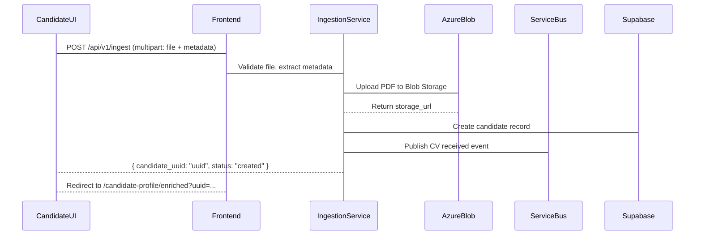
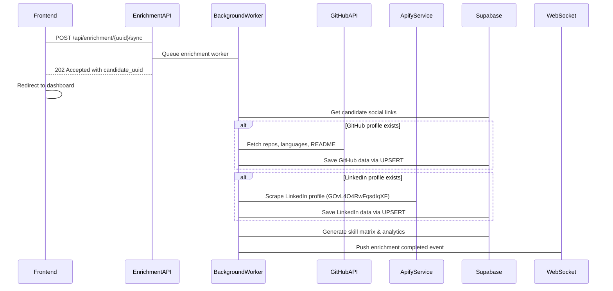

# SmartATS: Applicant Tracking System - Technical Design Documentation

## Overview
SmartATS (Smart Applicant Tracking System) is a modern, AI-powered applicant tracking platform that provides recruiters with a comprehensive view of candidate profiles and automated analysis. The system streamlines the recruitment process by ingesting candidate CVs, enriching profiles with social media data, and providing real-time analytics.

## Current Architecture

### Frontend Stack
- **Framework**: Next.js 15 with React 19
- **Language**: TypeScript
- **Styling**: Pure CSS (CSS Modules)
- **Analytics**: Recharts (for radar charts, timeline visualization)
- **State Management**: React Context API
- **Authentication**: Google OAuth (@react-oauth/google)
- **WebSocket**: Native WebSocket for real-time updates

### Backend Stack
- **Framework**: FastAPI
- **Language**: Python 3.11+
- **Database**: Supabase (PostgreSQL + pgvector extension)
- **Caching**: Local JSON files in `stored_data/` directory
- **Storage**: Azure Blob Storage
- **Messaging**: Azure Service Bus
- **AI APIs**: Gemini 2.0 Flash, GitHub REST API, Apify (for LinkedIn)

## Asynchronous Processing Pipeline

### Complete Workflow

#### Step 1: Candidate CV Submission
Candidates upload their CVs through the `Careers Portal`:



#### Step 2: Asynchronous Enrichment
When a candidate is queued for enrichment:



#### Step 3: Real-time UI Updates
The frontend establishes WebSocket connections to receive updates:

```typescript
// WebSocket connection in WorkspaceContext
const ws = new WebSocket(`${process.env.NEXT_PUBLIC_WS_URL}/api/enrichment/ws/v1/analysis/${candidateUuid}`);

ws.onmessage = (event) => {
  const { status, data } = JSON.parse(event.data);
  if (status === 'ENRICHED') {
    setEnrichedProfile(data);
    setEnrichmentStatus('ENRICHED');
    // Update dashboard in real-time (like Maya Lindqvist's view)
  }
};
```

## Core Modules

### 1. Ingestion Module (Azure-Powered CV Pipeline)
**Primary Function**: Process PDF resumes and queue them for enrichment

**Key Components**:
- `/api/v1/ingest` endpoint in `src/backend/modules/ingestion/adapters/azure_routes.py`
- **File Validation**: MIME type, size (< 10MB), magic bytes (%PDF)
- **Azure Integration**: 
  - `AzureBlobService` (`upload_pdf()`) - stores in "candidate-cvs" container
  - `AzureServiceBusService` (`publish_cv_received_event()`) - queues for processing
- **Database**: `SupabaseCandidateService.ensure_candidate_exists()`

**Key Files**:
- `src/backend/modules/ingestion/application/azure_ingestion_service.py`
- `src/backend/modules/ingestion/infra/azure_blob_service.py`
- `src/backend/modules/ingestion/infra/azure_service_bus_service.py`

### 2. Enrichment Module (Multi-Source Candidate Enrichment)
**Primary Function**: Fetch and merge data from GitHub, LinkedIn, and local analysis

**Key Components**:
- `/api/enrichment/{candidate_uuid}/sync` endpoint
- `/api/enrichment/ws/v1/analysis/{candidate_uuid}` WebSocket
- **GitHub Integration**: REST API with rate limit handling, README extraction
- **LinkedIn Integration**: Apify Actor `GOvL4O4RwFqsdIqXF` with fallback
- **Analytics**: Local skill matrix computation (5 categories: Frontend, Backend, Cloud Dev, InfoSec, ML/AI)

**Key Features**:
- **Cache-first strategy**: Checks local JSON cache before external API calls
- **WebSocket real-time updates**: Pushes enriched profile to connected clients
- **Skill Matrix Formula**: `score = 25 + (keyword_hits × 12) + (language_bias_pct × 0.35)`
- **Idempotent merge**: Safely handles repeated enrichment runs

**Key Files**:
- `src/backend/modules/enrichment/adapters/routes.py`
- `src/backend/modules/enrichment/application/enrichment_service.py`
- `src/backend/modules/enrichment/application/github_ingestion_service.py`
- `src/backend/modules/enrichment/application/linkedin_ingestion_service.py`

### 3. Frontend Workspace (ATS Dashboard)
**Primary Function**: Provides split-screen view of candidate CVs and analytics

**Component Hierarchy**:
```
EnrichedCandidateProfilePage
├── AppHeader (Navigation)
├── LoadingState (Conditional)
├── ErrorState (Conditional)
└── EnrichmentDashboard
    ├── EnrichmentPanel
    │   ├── Identity Stripe
    │   ├── GitHubCard (Accordion: Stats + Languages + README Tags)
    │   ├── LinkedInCard (Accordion: Profile Info + Work Experience)
    │   ├── Sync Status Indicator
    │   └── Disclaimer Banner
    └── EnrichedAnalytics
        ├── MatchConfidence (Circular Progress + Breakdown)
        ├── EnrichedRadar (Radar Chart)
        ├── CareerTimeline (Vertical Timeline)
        └── EnrichmentImpactSummary (Grid Stats)
```

## Data Flow Architecture

### Complete Pipeline Diagram

```mermaid
graph TB
    %% Candidate Entry
    CandidateUI[Candidates Portal] --> Frontend[Frontend Next.js 15]
    
    %% Step 1: Ingestion
    Frontend --> Backend[FastAPI Backend]
    Backend --> AzureBlob[Azure Blob Storage]
    Backend --> ServiceBus[Azure Service Bus]
    Backend --> SupabaseDB[USPabase Database]
    
    %% Step 2: Enrichment (Asynchronous)
    ServiceBus --> BackgroundWorker[Scraper Workers]
    BackgroundWorker --> GitHubAPI[GitHub REST API]
    BackgroundWorker --> Apify[Apify Actor GOvL4O4RwFqsdIqXF]
    BackgroundWorker --> SupabaseDB2[Supabase Database]
    
    %% Step 3: Real-time Sync
    SupabaseDB2 --> WebSocket[WebSocket Channel]
    WebSocket --> Frontend
    
    %% HR Dashboard
    Frontend --> HRDashboard[HR Dashboard UI]
    
    %% Cache Layer
    subgraph "Local Cache"
        GitHubCache[cache_github_{username}.json]
        LinkedInCache[cache_linkedin_{username}.json]
        ExpiredCache[(TTL: 1 hour)]
    end
    
    GitHubAPI --> GitHubCache
    Apify --> LinkedInCache
    BackgroundWorker -.-> ExpiredCache
```

### Data Storage Schema

**PostgreSQL Tables in Supabase**:

```sql
-- Main candidates table
CREATE TABLE candidates (
    uuid VARCHAR(255) PRIMARY KEY NOT NULL,
    full_name VARCHAR(255) NULL,
    email VARCHAR(255) NULL,
    phone VARCHAR(50) NULL,
    github_username VARCHAR(255) NULL,
    linkedin_url TEXT NULL,
    resume_text TEXT NULL,
    status VARCHAR(50) NOT NULL DEFAULT 'CREATED',
    created_at TIMESTAMPTZ NOT NULL DEFAULT NOW(),
    updated_at TIMESTAMPTZ NOT NULL DEFAULT NOW(),
    cv_file_path TEXT NULL,
    job_id VARCHAR(50) NULL
);

-- GitHub profiles table
CREATE TABLE github_profiles (
    id UUID PRIMARY KEY DEFAULT gen_random_uuid(),
    candidate_uuid VARCHAR(255) UNIQUE NOT NULL,
    public_repos_count INT NOT NULL DEFAULT 0,
    top_languages JSONB NULL,
    readme_content TEXT NULL,
    repos JSONB NULL,
    created_at TIMESTAMPTZ NOT NULL DEFAULT NOW(),
    updated_at TIMESTAMPTZ NOT NULL DEFAULT NOW()
);

-- LinkedIn profiles table
CREATE TABLE linkedin_profiles (
    id UUID PRIMARY KEY DEFAULT gen_random_uuid(),
    candidate_uuid VARCHAR(255) UNIQUE NOT NULL,
    full_name VARCHAR(255) NULL,
    headline VARCHAR(255) NULL,
    profile_url TEXT NULL,
    avatar_url TEXT NULL,
    experiences JSONB NULL,
    educations JSONB NULL,
    certifications JSONB NULL,
    created_at TIMESTAMPTZ NOT NULL DEFAULT NOW(),
    updated_at TIMESTAMPTZ NOT NULL DEFAULT NOW()
);
```

**JSONB Schema for Enriched Profiles**:

```sql
CREATE TABLE candidate_enrichments (
    id UUID PRIMARY KEY DEFAULT gen_random_uuid(),
    candidate_uuid VARCHAR(255) UNIQUE NOT NULL,
    enrichment_status VARCHAR(50) NOT NULL,
    CHECK (enrichment_status IN ('QUEUED', 'IN_PROGRESS', 'ENRICHED', 'ENRICHMENT_FAILED', 'NO_PROFILES_FOUND')),
    enriched_profile JSONB,
    github_username VARCHAR(255),
    linkedin_url TEXT,
    full_name VARCHAR(255),
    created_at TIMESTAMP WITH TIME ZONE DEFAULT NOW(),
    updated_at TIMESTAMP WITH TIME ZONE DEFAULT NOW()
);

-- GIN index for fast queries within JSONB
CREATE INDEX idx_candidate_enrichments_profile_gin ON candidate_enrichments USING GIN(enriched_profile);
```

## API Endpoints

### Ingestion Module APIs

| Method | Path | Auth | Description |
|--------|------|------|-------------|
| POST | `/api/v1/ingest` | None | Upload CV (multipart form) with metadata |

**Request Schema**:
```json
{
    "file": "PDF file (max 10MB)",
    "full_name": "Candidate full name",
    "email": "Candidate email", 
    "phone": "Phone number (optional)",
    "linkedin_url": "LinkedIn profile URL (optional)",
    "github_url": "GitHub username or URL (optional)",
    "job_id": "Associated job posting ID (optional)"
}
```

### Enrichment Module APIs

| Method | Path | Auth | Description |
|--------|------|------|-------------|
| POST | `/api/enrichment/{candidate_uuid}/sync` | recruiter, admin | Trigger full enrichment pipeline |
| GET | `/api/enrichment/{candidate_uuid}` | recruiter, admin | Get enrichment status |

### Frontend APIs

- **WebSocket**: `ws://host/api/enrichment/ws/v1/analysis/{candidate_uuid}` for real-time updates
- **Candidates**: Public portal for job listings and CV submission

## Error Handling & Fallback Strategy

### GitHub API Rate Limits
- **Detection**: HTTP 403 responses
- **Recovery**: Use cached data or return partial profile
- **Impact**: Delayed enrichment, partial data

### Apify Actor Failures
- **Detection**: Empty dataset or exception
- **Recovery**: Return structured fallback mock profile
- **Impact**: Full profile with mock LinkedIn data

### Network Timeouts
- **Detection**: HTTPX timeout exceptions
- **Recovery**: Retry with exponential backoff
- **Impact**: Slight delay, eventual success

### Cache Corruption
- **Detection**: JSON parse exception
- **Recovery**: Delete cache file and refetch
- **Impact**: One-time delay, transparent to user

### WebSocket Disconnection
- **Detection**: onclose event
- **Recovery**: Client-side reconnection with HTTP status polling fallback
- **Impact**: Brief interruption, automatic recovery

## Performance Optimizations

1. **Cache-first Strategy**: Local JSON cache reduces external API calls
2. **Parallel Processing**: GitHub and LinkedIn fetches can run concurrently
3. **Connection Pooling**: HTTPX AsyncClient reused across multiple requests
4. **Proxy Support**: Apify's proxy infrastructure rotates IPs to avoid LinkedIn blocks
5. **WebSocket Efficiency**: Only pushes final result, not intermediate progress

## Key Technologies & Tools

### Core Libraries
- **Python**: FastAPI, Pydantic, httpx, apify_client
- **JavaScript/TypeScript**: Next.js 15, React 18, WebSocket API
- **Database**: PostgreSQL (via Supabase)
- **Storage**: Azure Blob Storage
- **Messaging**: Azure Service Bus
- **Logging**: structlog (structured JSON)
- **Validation**: Pydantic models with magic byte checking

### Infrastructure
- **CI/CD**: GitHub Actions
- **Containerization**: Docker
- **Environment**: .env files with Pydantic Settings
- **Monitoring**: Structured logging for observability

## Development Notes

### Local Development Setup
1. Set up environment variables from `.env.example`
2. Deploy Azure resources (Blob Storage, Service Bus, Supabase)
3. Configure authentication (Google OAuth for frontend, JWT for backend)
4. Run backend: `python -m src.backend.apps.main`
5. Run frontend: `cd src/frontend && npm run dev`

### Configuration Environment Variables
```bash
# Core Services
AZURE_STORAGE_CONNECTION_STRING
AZURE_SERVICE_BUS_CONNECTION_STRING
SUPABASE_URL
SUPABASE_SERVICE_KEY

# AI/APIs
GOOGLE_API_KEY
GEMINI_MODEL=gemini-2.0-flash
GITHUB_API_TOKEN
APIFY_API_TOKEN

# Application
APP_NAME=SmartATS
APP_ENV=development
CORS_ORIGINS=http://localhost:3000
MAX_UPLOAD_MB=25
```

### Future Enhancements
1. Replace in-memory enrichment status with Redis for scalability
2. Implement proper retry mechanisms for failed enrichment jobs
3. Add job queue management (Celery/RQ) for better background processing
4. Implement database persistence for candidate enrichment state
5. Add WebSocket connection pooling for high-volume scenarios
6. Implement real-time progress tracking (instead of just final results)

## Conclusion

SmartATS provides a comprehensive, AI-powered applicant tracking system that streamlines the recruitment workflow through automated CV ingestion, multi-source profile enrichment, and real-time analytics visualization. The architecture combines modern web technologies (Next.js) with powerful backend services (FastAPI, Azure) to deliver a scalable, resilient platform for talent acquisition teams.

The system's asynchronous processing pipeline ensures non-blocking operations while maintaining real-time feedback through WebSocket connections, providing recruiters with immediate insights into candidate profiles as they become available.