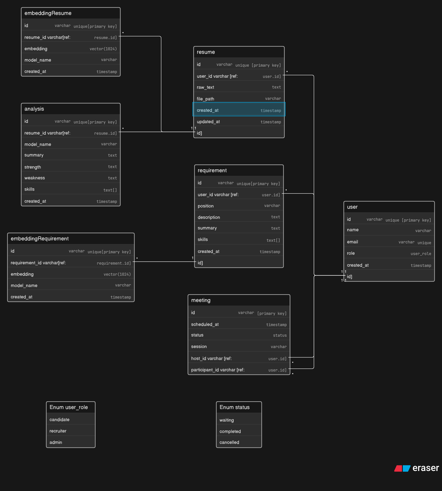

## 🗄️ Database Diagram

# code on erasers.io
Enum user_role {
  candidate
  recruiter
  admin
}
Enum status {
  waiting
  completed
  cancelled
}

// Bussiness
user{
  id varchar unique [primary key]
  name varchar
  email varchar unique
  role user_role
  created_at timestamp
}

resume{
  id varchar unique [primary key]
  user_id varchar [ref: > user.id]
  raw_text text
  file_path varchar
  created_at timestamp
  updated_at timestamp
}

requirement{
  id varchar unique[primary key]
  user_id varchar [ref:>user.id]
  position varchar
  description text
  summary text
  skills text[]
  created_at timestamp
}

meeting{
  id varchar [primary key]
  //time
  scheduled_at timestamp
  //done, wait
  status status
  session varchar 
  host_id varchar [ref:>user.id]
  participant_id varchar [ref:>user.id]
}

// AI
// embedding requirement and CV
embeddingResume{
  id varchar unique[primary key]
  //id trong từng loại
  resume_id varchar[ref:>resume.id]
  embedding vector(1024)
  //model embedding như text-embedding-3-large
  model_name varchar
  created_at timestamp
}

embeddingRequirement{
  id varchar unique[primary key]
  //id trong từng loại
  requirement_id varchar[ref:>requirement.id]
  embedding vector(1024)
  //model embedding như text-embedding-3-large
  model_name varchar
  created_at timestamp
}
// Analysis
analysis{
  id varchar unique[primary key]
  // cho chạy qua 1 vài model nên sẽ có nhiều phiên bảng
  resume_id varchar[ref:>resume.id]
  //model generation như gpt, llama
  model_name varchar
  summary text
  strength text
  weakness text
  skills text[]
  created_at timestamp  
}

