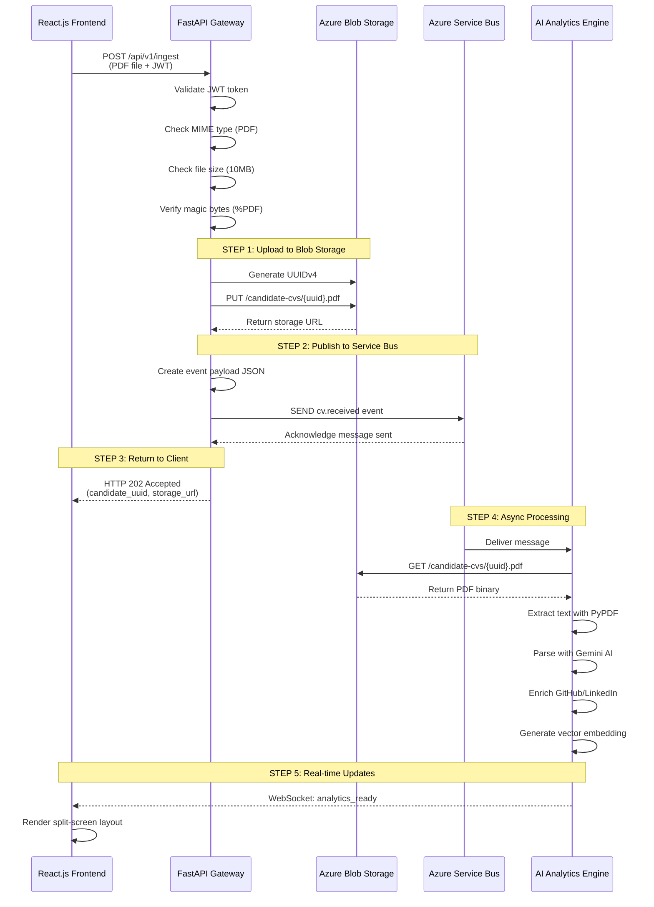

# Azure Cloud Architecture Documentation for SmartATS

## 1. Tổng Quan Kiến Trúc (Architecture Overview)

SmartATS sử dụng **Event-Driven Architecture (EDA)** kết hợp với **Cloud Persistence** để xử lý luồng Ingestion CV một cách hiệu quả, có khả năng mở rộng và đảm bảo tính nhất quán của dữ liệu.

### Lý do chọn kiến trúc hướng sự kiện

- **Tách rời trách nhiệm (Decoupling):** API Gateway chỉ chịu trách nhiệm nhận và validate file, trong khi AI Analytics Engine xử lý phân tích nặng một cách bất đồng bộ
- **Khả năng chịu tải (Scalability):** Hàng đợi tin nhắn giúp hệ thống xử lý peak load mà không làm sập API Gateway
- **Độ trễ thấp (Low Latency):** Client nhận phản hồi ngay lập tức (HTTP 202) mà không phải chờ AI xử lý xong
- **Khả năng phục hồi (Resilience):** Nếu AI Engine gặp lỗi, tin nhắn vẫn nằm trong queue và có thể retry

### Sơ đồ luồng dữ liệu

```
┌─────────────┐
│   Client    │
│ (React.js)  │
└──────┬──────┘
       │ POST /api/v1/ingest
       │ (form-data: PDF file)
       │ JWT Bearer Token
       ▼
┌─────────────────────────────────┐
│   API Gateway (FastAPI)         │
│   - Validate JWT                │
│   - Perimeter Guardrails        │
│   - MIME type check (PDF)       │
│   - File size check (10MB)      │
│   - Magic bytes verification   │
└──────┬──────────────────────────┘
       │
       ├─────────────────────────────────┐
       │                                 │
       ▼                                 ▼
┌──────────────────────┐      ┌──────────────────────┐
│ Azure Blob Storage   │      │ Azure Service Bus   │
│ - Upload PDF binary  │      │ - Publish event     │
│ - Generate UUIDv4    │      │ - Queue: cv-received│
│ - Container:         │      │ - Payload JSON      │
│   candidate-cvs      │      │   {candidate_uuid,   │
│ - Naming:            │      │    storage_url,     │
│   {uuid}.pdf         │      │    timestamp}       │
│ - Return storage URL │      └──────────┬───────────┘
└──────────┬───────────┘                 │
           │                             │
           │ HTTP 202 Accepted            │
           │ {candidate_uuid,            │
           │  storage_url,               │
           │  message}                   │
           │                             ▼
           │                   ┌──────────────────────┐
           │                   │ AI Analytics Engine  │
           │                   │ - Consume message     │
           │                   │ - Download PDF       │
           │                   │ - Extract text       │
           │                   │ - Gemini parsing     │
           │                   │ - GitHub enrichment   │
           │                   │ - LinkedIn scraping   │
           │                   │ - Vector embedding    │
           │                   └──────────────────────┘
           │
           ▼
┌─────────────────────────────────┐
│   Frontend Split-Screen         │
│   - Left: PDF Canvas Preview    │
│   - Right: Analytics Loading     │
│   - WebSocket Real-time Updates  │
└─────────────────────────────────┘
```

## 2. Azure Blob Storage - Kho Lưu Trữ Đối Tượng Phi Tập Trung

### Tác dụng cốt lõi

Azure Blob Storage đóng vai trò là **Persistent Storage Layer** cho hệ thống SmartATS, chịu trách nhiệm:

- Lưu trữ tài sản nhị phân gốc (file PDF/DOCX của ứng viên)
- Đảm bảo tính nhất quán và khả năng truy xuất dữ liệu lâu dài
- Cung cấp URL định danh cho các downstream services (AI Engine, Frontend Preview)
- Hỗ trợ phân phối nội dung (CDN) cho việc hiển thị PDF preview

### Cơ chế hoạt động chi tiết

#### Multipart File Ingestion tại API Gateway

```python
# File: modules/ingestion/adapters/azure_routes.py
@router.post("/ingest", response_model=IngestionResponse, status_code=202)
async def ingest_cv(
    file: UploadFile,
    current_user: AuthUser,  # JWT Authentication
    azure_service: AzureIngestionService,
):
    # 1. Perimeter Guardrails
    if file.content_type != "application/pdf":
        raise HTTPException(400, "Invalid file type")
    
    file_content = await file.read()
    if len(file_content) > 10 * 1024 * 1024:  # 10MB
        raise HTTPException(400, "File too large")
    
    if not file_content.startswith(b"%PDF"):  # Magic bytes
        raise HTTPException(400, "Invalid PDF")
    
    # 2. Azure Ingestion
    result = azure_service.ingest_pdf(file_content)
    return result
```

#### Deterministic Storage với UUIDv4

```python
# File: modules/ingestion/application/azure_ingestion_service.py
class AzureIngestionService:
    def ingest_pdf(self, file_content: bytes) -> IngestionResponse:
        # 1. Generate unique identifier
        candidate_uuid = str(uuid.uuid4())  # UUIDv4
        
        # 2. Upload to Azure Blob Storage
        storage_url = self._blob_service.upload_pdf(
            candidate_uuid, 
            file_content
        )
        
        # 3. Publish event to Service Bus
        self._service_bus_service.publish_cv_received_event(
            candidate_uuid, 
            storage_url
        )
        
        return IngestionResponse(
            status="Accepted",
            candidate_uuid=candidate_uuid,
            storage_url=storage_url,
            message="CV successfully ingested"
        )
```

#### Upload Process với BlobServiceClient

```python
# File: modules/ingestion/infra/azure_blob_service.py
class AzureBlobService:
    def upload_pdf(self, candidate_uuid: str, file_content: bytes) -> str:
        blob_name = f"{candidate_uuid}.pdf"
        
        # 1. Ensure container exists
        self._ensure_container_exists()
        
        # 2. Get blob client
        blob_client = self._blob_service_client.get_blob_client(
            container="candidate-cvs",
            blob=blob_name
        )
        
        # 3. Upload binary stream
        blob_client.upload_blob(file_content, overwrite=True)
        
        # 4. Return storage URL
        return blob_client.url
        # Example: https://smartatsstorage.blob.core.windows.net/candidate-cvs/abc123.pdf
```

#### REST API Communication

| Operation | Method | Endpoint | Purpose |
|-----------|--------|----------|---------|
| Upload File | PUT | `https://{account}.blob.core.windows.net/{container}/{blob}` | Upload PDF binary |
| Download File | GET | `https://{account}.blob.core.windows.net/{container}/{blob}` | Stream PDF for preview |
| Delete File | DELETE | `https://{account}.blob.core.windows.net/{container}/{blob}` | Remove candidate data (GDPR) |
| Check Existence | HEAD | `https://{account}.blob.core.windows.net/{container}/{blob}` | Verify blob exists |

#### Frontend Canvas Streaming

```typescript
// Frontend PDF Preview via Blob URL
const pdfUrl = URL.createObjectURL(file); // Local preview
// After upload, use Azure storage URL
const storageUrl = response.storage_url; // Azure preview

// Split-screen canvas rendering
<PDFViewer 
  file={storageUrl}
  onLoadSuccess={() => console.log("PDF loaded")}
/>
```

### Bảo mật & Phân quyền

#### Tại sao chọn Private Container?

- **Bảo mật PII (Personally Identifiable Information):** CV chứa thông tin cá nhân nhạy cảm (email, phone, address)
- **Chống Salary Bias:** Không cho phép truy cập công khai để tránh lộ lương và thông tin phỏng vấn
- **Tuân thủ GDPR:** Kiểm soát truy cập dữ liệu ứng viên theo quy định bảo vệ dữ liệu EU

#### SAS Token (Shared Access Signature)

```python
# Future implementation for secure temporary access
from azure.storage.blob import generate_blob_sas, BlobSasPermissions

def generate_download_url(blob_name: str, expiry_hours: int = 1) -> str:
    sas_token = generate_blob_sas(
        account_name="smartatsstorage",
        container_name="candidate-cvs",
        blob_name=blob_name,
        account_key=storage_account_key,
        permission=BlobSasPermissions(read=True),
        expiry=datetime.utcnow() + timedelta(hours=expiry_hours)
    )
    return f"{blob_client.url}?{sas_token}"
```

**Lợi ích SAS Token:**
- Hạn chế thời gian truy cập (1 giờ)
- Giới hạn quyền (read-only)
- Không cần expose account key
- Có thể revoke bất cứ lúc nào

## 3. Azure Service Bus - Trình Điều Phối Tin Nhắn Bất Đồng Bộ

### Tác dụng cốt lõi

Azure Service Bus đóng vai trò là **Message Broker** trong kiến trúc Event-Driven, chịu trách nhiệm:

- **Decouple (Tách rời):** Tách biệt luồng xử lý đồng bộ của API Gateway và luồng phân tích nặng của AI Worker Engine
- **Buffer (Bộ đệm):** Lưu trữ tin nhắn khi downstream services quá tải hoặc offline
- **Guaranteed Delivery:** Đảm bảo tin nhắn được xử lý ít nhất một lần (at-least-once delivery)
- **Scalability:** Hỗ trợ multiple consumers xử lý song song

### Cơ chế hoạt động chi tiết

#### Định dạng tin nhắn sự kiện `cv.received`

```json
{
  "candidate_uuid": "bc56281d-2630-45b0-a1fc-66168a9f41f7",
  "storage_url": "https://smartatsstorage.blob.core.windows.net/candidate-cvs/bc56281d-2630-45b0-a1fc-66168a9f41f7.pdf",
  "timestamp": "2026-07-11T07:48:02.565609Z"
}
```

**Trường dữ liệu:**
- `candidate_uuid`: UUIDv4 định danh duy nhất ứng viên (primary key)
- `storage_url`: URL đầy đủ để AI Engine download PDF từ Blob Storage
- `timestamp`: ISO 8601 format để tracking và debugging

#### Cơ chế Queue (Hàng đợi)

```python
# File: modules/ingestion/infra/azure_service_bus_service.py
class AzureServiceBusService:
    QUEUE_NAME = "cv-received-queue"
    
    def publish_cv_received_event(self, candidate_uuid: str, storage_url: str):
        event_payload = {
            "candidate_uuid": candidate_uuid,
            "storage_url": storage_url,
            "timestamp": datetime.now(timezone.utc).isoformat()
        }
        
        # Wrap JSON in ServiceBusMessage
        message = ServiceBusMessage(json.dumps(event_payload))
        
        # Send to queue
        with self._service_bus_client:
            sender = self._service_bus_client.get_queue_sender(
                queue_name=self.QUEUE_NAME
            )
            sender.send_messages(message)
```

**Nguyên lý hoạt động Queue:**

| Tính chất | Mô tả | Ứng dụng trong SmartATS |
|-----------|-------|-------------------------|
| **FIFO (First-In-First-Out)** | Tin nhắn được xử lý theo thứ tự đến | CV upload trước được phân tích trước |
| **Peek-Lock** | Consumer lock tin nhắn khi xử lý, unlock khi hoàn thành | Tránh duplicate processing |
| **Dead-Letter Queue** | Tin nhắn lỗi nhiều lần chuyển sang DLQ | Debug và manual retry |
| **Auto-Retry** | Tự động retry khi xử lý thất bại | Xử lý transient errors (network timeout) |

#### Cơ chế phản hồi Low-Latency

```python
# API Gateway returns immediately after message sent
@router.post("/api/v1/ingest", status_code=202)
async def ingest_cv(file: UploadFile):
    # 1. Upload to Blob Storage (synchronous, ~1-2s)
    storage_url = blob_service.upload_pdf(uuid, file_content)
    
    # 2. Publish to Service Bus (synchronous, ~100ms)
    service_bus.publish_cv_received_event(uuid, storage_url)
    
    # 3. Return immediately without waiting for AI processing
    return IngestionResponse(
        status="Accepted",
        candidate_uuid=uuid,
        storage_url=storage_url
    )
```

**Tại sao HTTP 202 Accepted?**
- **202 Accepted:** Request đã được chấp nhận để xử lý bất đồng bộ
- **200 OK:** Request đã hoàn thành xử lý (sai vì AI chưa chạy xong)
- **Client không phải chờ:** AI Engine có thể mất 10-30s để phân tích CV
- **Frontend có thể render:** Split-screen layout hiển thị ngay lập tức

#### Khả năng chịu tải (Scalability)

**Kịch bản Peak Load (100+ file upload cùng lúc):**

```
Scenario: 100 HR Managers upload CV simultaneously

Without Service Bus:
┌─────────────┐
│ API Gateway │ ◄── 100 requests concurrent
└──────┬──────┘
       │
       ▼
┌─────────────┐
│ AI Engine   │ ◄── BLOCKED (timeout, OOM)
└─────────────┘

With Service Bus:
┌─────────────┐
│ API Gateway │ ◄── 100 requests → 202 Accepted (100ms each)
└──────┬──────┘
       │
       ▼
┌─────────────────────┐
│ Service Bus Queue   │ ◄── 100 messages buffered
└──────┬──────────────┘
       │
       ▼
┌─────────────────────┐
│ AI Worker Pool      │ ◄── 10 workers processing concurrently
│ (Auto-scaling)      │
└─────────────────────┘
```

**Lợi ích:**
- API Gateway không bị overload
- AI Engine có thể scale horizontal (thêm worker)
- Tin nhắn được lưu trữ an toàn trong queue
- Không mất dữ liệu khi system restart

## 4. Kịch Bản Phối Hợp Tuần Tự (Sequence Flow)

### Thứ tự gọi dịch vụ trong mã nguồn



### Bảng tóm tắt sequence

| Step | Service | Operation | Output | Time |
|------|---------|-----------|--------|------|
| 1 | API Gateway | Validate JWT | User context | ~50ms |
| 2 | API Gateway | Perimeter Guardrails | Validated file | ~10ms |
| 3 | Azure Blob Storage | Upload PDF | storage_url | ~1-2s |
| 4 | Azure Service Bus | Publish event | Message queued | ~100ms |
| 5 | API Gateway | Return 202 Accepted | Response to client | ~10ms |
| 6 | AI Engine | Consume message | PDF binary | ~100ms |
| 7 | AI Engine | Process CV | Analytics data | ~10-30s |
| 8 | AI Engine | WebSocket push | Real-time update | ~50ms |

**Quan trọng:** Blob Storage luôn chạy trước Service Bus vì cần `storage_url` để đưa vào payload tin nhắn.

## 5. Quy Tắc Quản Trị Hạ Tầng Cho Nhà Phát Triển

### Cấu hình file môi trường `.env` an toàn

#### Backend (.env)

```bash
# Azure Cloud Services
AZURE_STORAGE_CONNECTION_STRING="DefaultEndpointsProtocol=https;AccountName=smartatsstorage;AccountKey=...;EndpointSuffix=core.windows.net"
AZURE_SERVICE_BUS_CONNECTION_STRING="Endpoint=sb://smartats.servicebus.windows.net/;SharedAccessKeyName=RootManageSharedAccessKey;SharedAccessKey=..."

# Security
JWT_SECRET=your_jwt_secret_minimum_32_characters_long
GOOGLE_CLIENT_ID=your_google_oauth_client_id
```

#### Frontend (.env.local)

```bash
# Frontend Environment Variables (public)
NEXT_PUBLIC_API_BASE_URL=http://localhost:8000
NEXT_PUBLIC_GOOGLE_CLIENT_ID=your_google_oauth_client_id
```

**Quy tắc bảo mật:**
- ❌ **KHÔNG** commit `.env` file vào Git
- ✅ **CÓ** commit `.env.example` với template
- ✅ **CÓ** sử dụng `env-cmd` để load environment variables
- ✅ **CÓ** prefix `NEXT_PUBLIC_` cho variables cần expose ở client
- ❌ **KHÔNG** đặt connection strings trong code

### Cơ chế Xoay vòng khóa bảo mật (Key Rotation)

Azure cung cấp **2 Access Keys song song** cho mỗi service:

```
Azure Storage Account:
├── Primary Key (key1)
└── Secondary Key (key2)

Azure Service Bus Namespace:
├── Primary Key (key1)  
└── Secondary Key (key2)
```

#### Quy trình Key Rotation

**Phase 1: Preparation (1-2 ngày trước)**
```bash
# Current production uses key1
AZURE_STORAGE_CONNECTION_STRING="...AccountKey=key1;..."
```

**Phase 2: Update Configuration (Rolling Update)**
```bash
# Update .env to use key2
AZURE_STORAGE_CONNECTION_STRING="...AccountKey=key2;..."
```

**Phase 3: Deploy & Monitor**
```bash
# Restart services with new connection string
npm run backend:dev
# Monitor logs for connection errors
```

**Phase 4: Regenerate Old Key**
```bash
# After successful migration, regenerate key1
# Azure Portal → Storage Account → Access Keys → Regenerate key1
```

**Phase 5: Future Rotation**
```bash
# Next rotation: use key1 again (newly regenerated)
AZURE_STORAGE_CONNECTION_STRING="...AccountKey=key1;..."
```

**Lợi ích Key Rotation:**
- **Zero Downtime:** Không cần stop service khi rotate keys
- **Rollback Capability:** Có thể quay lại key cũ nếu có lỗi
- **Security Best Practice:** Giảm exposure time của mỗi key
- **Compliance:** Tuân thủ các tiêu chuẩn bảo mật (SOC2, ISO27001)

#### Automation với Azure CLI

```bash
# Script to automate key rotation
#!/bin/bash
STORAGE_ACCOUNT="smartatsstorage"

# Regenerate secondary key
az storage account keys renew \
  --account-name $STORAGE_ACCOUNT \
  --key secondary

# Update application configuration
# (CI/CD pipeline updates .env and restarts services)

# Wait for verification
sleep 300

# Regenerate primary key (for next rotation)
az storage account keys renew \
  --account-name $STORAGE_ACCOUNT \
  --key primary
```

### Monitoring & Alerting

**Azure Metrics cần theo dõi:**

| Service | Metric | Threshold | Action |
|---------|--------|-----------|--------|
| Blob Storage | Ingress Data | > 10GB/day | Review usage patterns |
| Blob Storage | Egress Data | > 50GB/day | Check for abuse |
| Service Bus | Dead Lettered Messages | > 10/hour | Investigate errors |
| Service Bus | Queue Length | > 1000 messages | Scale consumers |

**Log Structured Logging:**

```python
logger.info(
    "azure.ingestion.complete",
    candidate_uuid=candidate_uuid,
    storage_url=storage_url,
    file_size_bytes=len(file_content),
    user_email=current_user.email,
    timestamp=datetime.now(timezone.utc).isoformat()
)
```

---

## Tài Liệu Tham Khảo

- [Azure Blob Storage Documentation](https://docs.microsoft.com/azure/storage/blobs/)
- [Azure Service Bus Documentation](https://docs.microsoft.com/azure/service-bus/)
- [Event-Driven Architecture Pattern](https://docs.microsoft.com/azure/architecture/patterns/event-driven)
- [FastAPI Best Practices](https://fastapi.tiangolo.com/)
- [React.js with TypeScript](https://react.dev/learn/typescript)

---

**Document Version:** 1.0  
**Last Updated:** 2026-07-11  
**Author:** SmartATS Architecture Team  
**Status:** Production Ready
