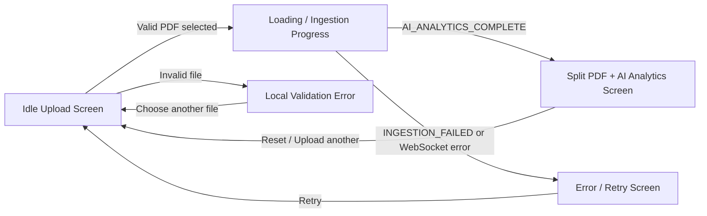
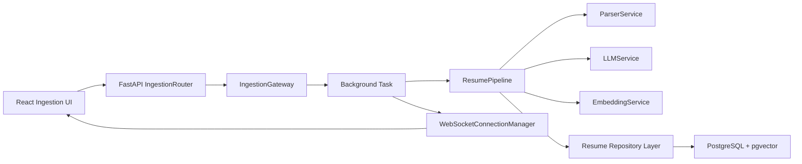

# Ingestion Module Design Steps

## Purpose

This document summarizes the steps required to complete two project tasks:

1. Author Class Specifications & Screen Event Handling for the Ingestion Module.
2. Design Ingestion Gateway Infrastructure & WebSocket Router Backend.

The content is aligned with `Template2-Design.pdf`, especially:

- Section 3: Architectural Design
- Section 3.2: Class Diagram
- Section 3.3: Class Specifications
- Section 4: Data Design
- Section 5: User Interface and User Experience Design
- Section 5.2: Screen Specifications and Event Handling

## Current Project Context

The current project already contains the main frontend ingestion screen and the backend resume processing pipeline.

Important existing frontend files:

- `src/frontend/src/App.tsx`
- `src/frontend/context/WorkspaceContext.tsx`
- `src/frontend/src/components/IdleUploadZone.tsx`
- `src/frontend/src/components/PdfToolbar.tsx`
- `src/frontend/src/components/AiAnalyticsWorkspace.tsx`
- `src/frontend/src/components/FallbackDataWizard.tsx`
- `src/frontend/src/services/mockAnalyticsService.ts`

Important existing backend files:

- `src/backend/app/pipelines/resumeUploading_pipeline.py`
- `src/backend/app/services/parser_service.py`
- `src/backend/app/services/llm_service.py`
- `src/backend/app/services/embedding_service.py`
- `src/backend/app/services/ranking_service.py`
- `src/backend/app/repositories/resume_repository.py`
- `src/backend/app/repositories/resume_analysis_repository.py`
- `src/backend/app/repositories/resume_embedding_repository.py`
- `src/backend/app/models/resume.py`
- `src/backend/app/models/resume_analysis.py`
- `src/backend/app/models/resume_embedding.py`
- `src/backend/app/database/init_db.sql`

Current implementation gap:

- `src/backend/main.py` is empty.
- `src/backend/app/api/candidate.py` is empty.
- The frontend currently uses `mockAnalyticsService` instead of a real upload endpoint.
- The WebSocket pipeline is already sketched in `WorkspaceContext.tsx`, but it is not connected to a real backend route.

Therefore, the design document should clearly state both the existing implementation and the required backend infrastructure that must be added.

## Task 1: Author Class Specifications & Screen Event Handling

### Step 1: Identify Main Ingestion Classes

Select the most important classes from the ingestion module and document them in the Class Specifications section.

Recommended classes:

| Seq | Class | Layer | Reason |
| --- | --- | --- | --- |
| 1 | `WorkspaceProvider` | Frontend state management | Controls ingestion UI state, local PDF preview, analytics data, and error state. |
| 2 | `IdleUploadZone` | Frontend UI | Handles drag-and-drop upload, file picker, and local validation. |
| 3 | `IngestionRouter` | Backend API | Receives upload requests and starts ingestion jobs. |
| 4 | `IngestionGateway` | Backend application service | Saves files, creates job IDs, and coordinates background processing. |
| 5 | `WebSocketRouter` | Backend realtime API | Exposes WebSocket endpoint for ingestion progress updates. |
| 6 | `WebSocketConnectionManager` | Backend infrastructure | Tracks active sockets and broadcasts job events. |
| 7 | `ResumePipeline` | Backend pipeline | Orchestrates parse, LLM analysis, embedding, and persistence. |
| 8 | `ParserService` | Backend domain service | Extracts and cleans text from PDF files. |
| 9 | `LLMService` | Backend AI service | Converts raw resume text into structured analysis. |
| 10 | `EmbeddingService` | Backend AI service | Generates semantic embeddings for summary, skills, and experience. |
| 11 | `ResumeRepository` | Backend persistence | Persists and retrieves resume records. |
| 12 | `Resume`, `ResumeAnalysis`, `ResumeEmbedding` | Data model | Represents stored resume data, AI analysis, and vector embeddings. |

If the report only requires 9-10 classes, prioritize classes 1-10.

### Step 2: Use the Required Class Specification Format

For each class, write:

- Purpose
- Inheritance
- Attributes table
- Methods table
- Exception handling
- Design considerations

Template:

| Seq | Property | Modifier | Constraint | Description |
| --- | --- | --- | --- | --- |
| 1 | property_name | private/public | Required/Optional | Meaning of the property. |

| Seq | Operation | Modifier | Constraint | Description |
| --- | --- | --- | --- | --- |
| 1 | method_name() | public/private | Sync/Async | Meaning of the method. |

### Step 3: Suggested Class Specification Content

#### WorkspaceProvider

Purpose: Central frontend state manager for the resume ingestion workspace.

Inheritance: None.

Attributes:

| Seq | Property | Modifier | Constraint | Description |
| --- | --- | --- | --- | --- |
| 1 | `status` | private state | Required | Current ingestion state: `IDLE`, `LOADING`, `SUCCESS`, or `ERROR`. |
| 2 | `pdfUrl` | private state | Optional | Local object URL used to preview the uploaded PDF. |
| 3 | `analyticData` | private state | Optional | Candidate analytics returned by the backend or mock service. |
| 4 | `errorMessage` | private state | Optional | Error message displayed by the fallback wizard. |

Methods:

| Seq | Operation | Modifier | Constraint | Description |
| --- | --- | --- | --- | --- |
| 1 | `uploadResume(file)` | public | Async | Starts the ingestion flow for an uploaded PDF file. |
| 2 | `resetWorkspace()` | public | Sync | Clears all workspace state and returns the UI to idle mode. |
| 3 | `_initWebSocketPipeline(uuid)` | private | Async event-driven | Opens a WebSocket stream and listens for backend analytics completion events. |

Exception handling:

- Invalid backend or mock response sets `status` to `ERROR`.
- WebSocket errors set `errorMessage` and close the socket.

Design considerations:

- The current implementation uses mock mode.
- Real mode should call the ingestion upload API, receive a job ID, and open a WebSocket stream for that job.

#### IdleUploadZone

Purpose: Provides the initial PDF upload screen and validates local file input.

Inheritance: None.

Attributes:

| Seq | Property | Modifier | Constraint | Description |
| --- | --- | --- | --- | --- |
| 1 | `isDragging` | private state | Required | Controls drag-over visual state. |
| 2 | `localError` | private state | Optional | Stores local validation error messages. |
| 3 | `fileInputRef` | private ref | Required | References hidden file input element. |

Methods:

| Seq | Operation | Modifier | Constraint | Description |
| --- | --- | --- | --- | --- |
| 1 | `handleFileValidation(file)` | private | Sync | Validates file type and size before calling upload handler. |
| 2 | `handleDragOver(event)` | private | Sync | Prevents default browser behavior and activates drag state. |
| 3 | `handleDragLeave()` | private | Sync | Clears drag state. |
| 4 | `handleDrop(event)` | private | Sync | Reads the dropped file and validates it. |
| 5 | `handleInputChange(event)` | private | Sync | Reads file selected from file picker. |

Exception handling:

- Non-PDF files show `Invalid file format. Only PDF files are accepted.`
- Files larger than 10 MB show `File exceeds 10 MB size limit.`

Design considerations:

- Local validation prevents unnecessary backend upload attempts.
- The component delegates real ingestion behavior to `onFileDrop`.

#### IngestionRouter

Purpose: Backend FastAPI router that receives resume upload requests and starts asynchronous ingestion.

Inheritance: FastAPI router module, no class inheritance required.

Attributes:

| Seq | Property | Modifier | Constraint | Description |
| --- | --- | --- | --- | --- |
| 1 | `router` | public | Required | FastAPI `APIRouter` instance for ingestion endpoints. |
| 2 | `gateway` | private | Required | Instance of `IngestionGateway`. |

Methods:

| Seq | Operation | Modifier | Constraint | Description |
| --- | --- | --- | --- | --- |
| 1 | `upload_resume(file, background_tasks, session)` | public | Async | Validates upload request, creates job, schedules background processing, and returns `202 Accepted`. |
| 2 | `get_job_status(job_id)` | public | Async | Returns current ingestion status for polling fallback. |

Exception handling:

- Invalid file type returns HTTP 400.
- File storage failure returns HTTP 500.
- Unknown job ID returns HTTP 404.

Design considerations:

- The route should return quickly and process heavy AI work in the background.
- It should not block the request while parsing, analyzing, or embedding the resume.

#### IngestionGateway

Purpose: Application service that coordinates file storage, job creation, background processing, and event emission.

Inheritance: None.

Attributes:

| Seq | Property | Modifier | Constraint | Description |
| --- | --- | --- | --- | --- |
| 1 | `pipeline` | private | Required | Instance of `ResumePipeline`. |
| 2 | `connection_manager` | private | Required | WebSocket manager used to broadcast events. |
| 3 | `upload_dir` | private | Required | Directory where uploaded PDFs are temporarily stored. |
| 4 | `jobs` | private | Required | In-memory job status registry, replaceable by Redis or database later. |

Methods:

| Seq | Operation | Modifier | Constraint | Description |
| --- | --- | --- | --- | --- |
| 1 | `create_job(file, user_id)` | public | Async | Stores file, creates a job ID, and returns initial job metadata. |
| 2 | `run_job(job_id, file_path, user_id, session)` | public | Async background | Runs the resume pipeline and broadcasts progress events. |
| 3 | `get_status(job_id)` | public | Sync/Async | Returns the current job status. |
| 4 | `emit(job_id, event_type, data, error)` | private | Async | Updates job state and broadcasts an event to WebSocket clients. |

Exception handling:

- Pipeline exceptions are caught and converted to `INGESTION_FAILED`.
- File I/O errors are reported before starting the background task.

Design considerations:

- Keeps API routes thin.
- Makes the ingestion flow easier to test.
- Can later be migrated from in-memory jobs to Redis or PostgreSQL.

#### WebSocketRouter

Purpose: Backend router that exposes a WebSocket endpoint for realtime ingestion status.

Inheritance: FastAPI WebSocket route module, no class inheritance required.

Attributes:

| Seq | Property | Modifier | Constraint | Description |
| --- | --- | --- | --- | --- |
| 1 | `router` | public | Required | FastAPI `APIRouter` instance. |
| 2 | `connection_manager` | private | Required | Shared WebSocket connection manager. |

Methods:

| Seq | Operation | Modifier | Constraint | Description |
| --- | --- | --- | --- | --- |
| 1 | `websocket_ingestion(websocket, job_id)` | public | Async | Accepts socket, registers it by job ID, sends current state if available, and waits for disconnect. |

Exception handling:

- Cleans up disconnected sockets.
- Ignores normal client close events.
- Reports abnormal disconnects through logs.

Design considerations:

- Multiple browser tabs may subscribe to the same job ID.
- The endpoint should be lightweight and should not execute the ingestion pipeline itself.

#### WebSocketConnectionManager

Purpose: Tracks active WebSocket clients and broadcasts ingestion events.

Inheritance: None.

Attributes:

| Seq | Property | Modifier | Constraint | Description |
| --- | --- | --- | --- | --- |
| 1 | `active_connections` | private | Required | Dictionary mapping `job_id` to a list of WebSocket connections. |

Methods:

| Seq | Operation | Modifier | Constraint | Description |
| --- | --- | --- | --- | --- |
| 1 | `connect(job_id, websocket)` | public | Async | Accepts and registers a new socket. |
| 2 | `disconnect(job_id, websocket)` | public | Sync | Removes a socket from the job subscription list. |
| 3 | `broadcast(job_id, message)` | public | Async | Sends an event to all clients subscribed to a job. |
| 4 | `send_personal_message(websocket, message)` | public | Async | Sends one event to a specific socket. |

Exception handling:

- Failed sends remove broken sockets.
- Empty job connection lists are cleaned up.

Design considerations:

- The manager is an infrastructure component and should not contain business logic.
- In production, this may be replaced by Redis Pub/Sub for multi-instance deployment.

#### ResumePipeline

Purpose: Orchestrates the full resume ingestion pipeline from PDF parsing to database persistence.

Inheritance: None.

Attributes:

| Seq | Property | Modifier | Constraint | Description |
| --- | --- | --- | --- | --- |
| 1 | `parser_service` | private | Required | Extracts and cleans resume text from PDF. |
| 2 | `llm_service` | private | Required | Performs structured AI analysis. |
| 3 | `embedding_service` | private | Required | Generates semantic vectors. |

Methods:

| Seq | Operation | Modifier | Constraint | Description |
| --- | --- | --- | --- | --- |
| 1 | `process(file_path, user_id, session)` | public | Async | Runs parsing, analysis, embedding, and persistence for one resume. |
| 2 | `process_batch(file_paths, session)` | public | Async recommended | Processes multiple resumes. |
| 3 | `process_requirement(requirement_text, session)` | public | Sync currently | Analyzes a job requirement. |

Exception handling:

- Encrypted PDFs raise parsing errors.
- Invalid LLM JSON raises a validation error.
- Database failures roll back the transaction.

Design considerations:

- The current process method should be extended with event callbacks so the gateway can broadcast progress.
- Each major step should emit an event such as `PARSING_STARTED`, `ANALYSIS_STARTED`, and `AI_ANALYTICS_COMPLETE`.

#### ParserService

Purpose: Extracts raw text from uploaded PDF resumes and normalizes formatting.

Inheritance: None.

Attributes:

| Seq | Property | Modifier | Constraint | Description |
| --- | --- | --- | --- | --- |
| 1 | None | - | - | Stateless service. |

Methods:

| Seq | Operation | Modifier | Constraint | Description |
| --- | --- | --- | --- | --- |
| 1 | `parse(file_path)` | public | Sync | Opens PDF and extracts text from each page. |
| 2 | `cleanup(text)` | public | Sync | Normalizes bullets, whitespace, and blank lines. |
| 3 | `process(file_path)` | public | Sync | Runs parse and cleanup. |

Exception handling:

- Encrypted PDF raises `ValueError("PDF is encrypted.")`.
- Missing or corrupted PDF should be converted to a user-friendly ingestion failure.

Design considerations:

- PDF parsing is deterministic and should run before any LLM call.
- Clean text improves AI extraction quality.

#### LLMService

Purpose: Converts cleaned resume text into structured analysis fields.

Inheritance: None.

Attributes:

| Seq | Property | Modifier | Constraint | Description |
| --- | --- | --- | --- | --- |
| 1 | `provider` | private | Required | Concrete LLM provider such as `GroqProvider`. |

Methods:

| Seq | Operation | Modifier | Constraint | Description |
| --- | --- | --- | --- | --- |
| 1 | `analyze_resume(resume_text)` | public | Sync | Sends prompt to LLM and parses JSON result. |
| 2 | `summarize_resume(resume_analysis)` | public | Sync | Extracts summary. |
| 3 | `extract_skills(resume_analysis)` | public | Sync | Extracts skills. |
| 4 | `extract_experience(resume_analysis)` | public | Sync | Extracts experience timeline. |
| 5 | `extract_strengths(resume_analysis)` | public | Sync | Extracts strengths. |
| 6 | `extract_weaknesses(resume_analysis)` | public | Sync | Extracts weaknesses. |

Exception handling:

- Invalid LLM JSON raises `ValueError("LLM returned invalid JSON.")`.
- Provider timeout or missing API key should become `INGESTION_FAILED`.

Design considerations:

- Prompt asks for JSON-only output to simplify parsing.
- The service should validate returned data using Pydantic schemas.

#### EmbeddingService

Purpose: Generates vector embeddings for resume summary, skills, and experience.

Inheritance: None.

Attributes:

| Seq | Property | Modifier | Constraint | Description |
| --- | --- | --- | --- | --- |
| 1 | `model` | private | Required | SentenceTransformer model `intfloat/multilingual-e5-base`. |

Methods:

| Seq | Operation | Modifier | Constraint | Description |
| --- | --- | --- | --- | --- |
| 1 | `embed_text(text)` | public | Sync | Converts text into a numeric embedding vector. |
| 2 | `embed_resume(analysis)` | public | Sync | Generates summary, skills, and experience embeddings. |
| 3 | `embed_requirement(requirement)` | public | Sync | Generates query embeddings for job requirements. |

Exception handling:

- Empty or malformed experience data may fail if expected fields are missing.
- Model loading failure should be reported as backend configuration failure.

Design considerations:

- Uses `passage:` prefix for resume embeddings.
- Uses `query:` prefix for requirement embeddings.
- The database schema expects vector size 768.

### Step 4: Screen Diagram

Recommended screen transition diagram:



### Step 5: Screen Event Handling

#### Screen: Idle Upload Screen

Presentation:

- Left side displays a drag-and-drop PDF upload zone.
- Right side displays a blurred analytics preview placeholder.
- User can drag a PDF file or click Browse Files.

Event handling:

| Event | Handler | Logic |
| --- | --- | --- |
| Drag over upload area | `handleDragOver()` | Prevent default browser behavior and set `isDragging=true`. |
| Drag leaves upload area | `handleDragLeave()` | Set `isDragging=false`. |
| Drop file | `handleDrop()` | Read first dropped file, clear drag state, call validation. |
| Browse button click | button `onClick` | Stop event propagation and open hidden file picker. |
| File input changed | `handleInputChange()` | Read selected file and call validation. |
| Invalid file type | `handleFileValidation()` | Show local error and do not call backend. |
| File too large | `handleFileValidation()` | Show size-limit error and do not call backend. |
| Valid PDF | `handleFileValidation()` | Call `onFileDrop(file)`. |

#### Screen: Loading / Ingestion Progress

Presentation:

- Left side immediately previews the uploaded PDF using a local object URL.
- Right side displays loading skeleton while backend processes the resume.

Event handling:

| Event | Handler | Logic |
| --- | --- | --- |
| Upload starts | `uploadResume(file)` | Set `status=LOADING`, clear previous error, and create local PDF URL. |
| Upload API returns job ID | `uploadResume(file)` | Open WebSocket stream for returned job ID. |
| WebSocket progress event | `ws.onmessage` | Optionally update progress labels or internal status. |
| WebSocket completion | `ws.onmessage` | Store analytics data and set `status=SUCCESS`. |
| WebSocket failure | `ws.onerror` | Set error message and move to error state. |

#### Screen: Split PDF + AI Analytics Screen

Presentation:

- Left panel displays the candidate resume PDF.
- Right panel displays the AI analytics workspace.

Event handling:

| Event | Handler | Logic |
| --- | --- | --- |
| `AI_ANALYTICS_COMPLETE` received | `ws.onmessage` | Parse payload, set `analyticData`, set `status=SUCCESS`, close socket. |
| Reset clicked | `resetWorkspace()` | Clear PDF URL, analytics data, error, and return to idle state. |

#### Screen: Error / Retry Screen

Presentation:

- Displays user-friendly ingestion error.
- Provides retry action.

Event handling:

| Event | Handler | Logic |
| --- | --- | --- |
| Backend processing error | `ws.onmessage` or API catch block | Set `status=ERROR` and store error message. |
| Retry clicked | `resetWorkspace()` | Clear state and return to upload screen. |

## Task 2: Design Ingestion Gateway Infrastructure & WebSocket Router Backend

### Step 1: Add Backend Files

Recommended new files:

```text
src/backend/main.py
src/backend/app/api/ingestion.py
src/backend/app/api/websocket.py
src/backend/app/services/ingestion_gateway.py
src/backend/app/services/websocket_manager.py
src/backend/app/schemas/ingestion_event.py
```

### Step 2: Backend Endpoint Design

Recommended endpoints:

| Endpoint | Method | Description |
| --- | --- | --- |
| `/api/v1/ingestion/resumes` | POST | Upload a PDF resume and create an ingestion job. |
| `/api/v1/ingestion/jobs/{job_id}` | GET | Return current job status for polling fallback. |
| `/ws/v1/ingestion/{job_id}` | WebSocket | Stream ingestion progress and final analytics result. |

### Step 3: Backend Flow

```text
React Upload Screen
  -> POST /api/v1/ingestion/resumes
  -> IngestionRouter validates PDF
  -> IngestionGateway saves file and creates job_id
  -> BackgroundTask runs ResumePipeline
  -> ResumePipeline emits progress events
  -> WebSocketConnectionManager broadcasts events
  -> Frontend receives AI_ANALYTICS_COMPLETE or INGESTION_FAILED
```

### Step 4: Architecture Diagram



### Step 5: WebSocket Event Contract

Recommended event payload:

```json
{
  "type": "PARSING_STARTED",
  "job_id": "uuid",
  "resume_id": null,
  "data": null,
  "error": null
}
```

Recommended event types:

| Event Type | Description |
| --- | --- |
| `INGESTION_QUEUED` | Upload accepted and background job created. |
| `PARSING_STARTED` | PDF parsing has started. |
| `PARSING_COMPLETE` | PDF text extraction completed. |
| `ANALYSIS_STARTED` | LLM analysis has started. |
| `ANALYSIS_COMPLETE` | LLM analysis completed. |
| `EMBEDDING_STARTED` | Vector embedding generation has started. |
| `PERSISTENCE_COMPLETE` | Resume, analysis, and embeddings saved to database. |
| `AI_ANALYTICS_COMPLETE` | Final analytics payload is ready for frontend rendering. |
| `INGESTION_FAILED` | Pipeline failed and error information is available. |

### Step 6: Data Design

Use the existing database schema from `src/backend/app/database/init_db.sql`.

Main tables:

| Table | Purpose |
| --- | --- |
| `resumes` | Stores uploaded resume metadata, raw extracted text, file path, and owner user ID. |
| `resume_analyses` | Stores structured LLM analysis such as summary, skills, strengths, weaknesses, and experience timeline. |
| `resume_embeddings` | Stores vector embeddings for summary, skills, and experience. |
| `users` | Stores candidate, recruiter, and admin user accounts. |

Important relationships:

| Relationship | Cardinality |
| --- | --- |
| `users -> resumes` | One user can own many resumes. |
| `resumes -> resume_analyses` | One resume can have many analysis versions. |
| `resumes -> resume_embeddings` | One resume can have many embedding records, usually one per model. |

Recommended temporary job state:

| Field | Type | Description |
| --- | --- | --- |
| `job_id` | UUID/string | Unique ingestion job identifier. |
| `status` | string | Current job state. |
| `resume_id` | UUID/string/null | Linked resume record after persistence. |
| `error` | string/null | Failure reason if ingestion fails. |
| `created_at` | datetime | Job creation time. |
| `updated_at` | datetime | Last state update time. |

Current implementation can use an in-memory dictionary. Production implementation should move this state to Redis or PostgreSQL.

### Step 7: Frontend Integration Changes

Current frontend behavior:

- `WorkspaceContext.uploadResume()` calls `mockAnalyticsService(file)`.
- `_initWebSocketPipeline(uuid)` is currently unused and points to `wss://ats.internal:8421/stream/{uuid}`.

Required real-mode behavior:

1. `uploadResume(file)` creates `FormData`.
2. It sends `POST /api/v1/ingestion/resumes`.
3. Backend returns `job_id`.
4. Frontend opens `ws://localhost:8000/ws/v1/ingestion/{job_id}`.
5. Frontend listens for `AI_ANALYTICS_COMPLETE`.
6. On success, set `analyticData` and `status=SUCCESS`.
7. On failure, set `status=ERROR` and show error message.

### Step 8: Implementation Checklist

Backend checklist:

- [ ] Implement `main.py` with FastAPI app creation, CORS, and router registration.
- [ ] Implement `IngestionRouter`.
- [ ] Implement `WebSocketRouter`.
- [ ] Implement `WebSocketConnectionManager`.
- [ ] Implement `IngestionGateway`.
- [ ] Add ingestion event schema.
- [ ] Save uploaded PDF to a controlled upload directory.
- [ ] Schedule `ResumePipeline.process()` as a background task.
- [ ] Broadcast progress events during each pipeline phase.
- [ ] Return final payload compatible with frontend `CandidateAnalytics`.
- [ ] Add error handling for invalid PDF, parser failure, LLM JSON failure, embedding failure, and database failure.

Frontend checklist:

- [ ] Replace `mockAnalyticsService(file)` with real upload API call.
- [ ] Store returned `job_id`.
- [ ] Open WebSocket using the returned `job_id`.
- [ ] Parse backend event payloads.
- [ ] Map backend final result to `CandidateAnalytics`.
- [ ] Handle `INGESTION_FAILED`.
- [ ] Add polling fallback using `GET /api/v1/ingestion/jobs/{job_id}` if WebSocket disconnects.

Document checklist:

- [ ] Add ingestion architecture diagram.
- [ ] Add ingestion class diagram.
- [ ] Add class specifications for 9-10 major classes.
- [ ] Add data flow diagram.
- [ ] Add data table specifications for `resumes`, `resume_analyses`, and `resume_embeddings`.
- [ ] Add screen transition diagram.
- [ ] Add screen event handling tables.
- [ ] Add limitations and future improvements.

## Recommended Final Report Structure

Place the ingestion content in the template as follows:

```text
3 Architectural Design
  1.1 Architecture Diagram
    - Ingestion Gateway + ResumePipeline + WebSocket architecture

  1.2 Class Diagram
    - Ingestion module class diagram

  1.3 Class Specifications
    - WorkspaceProvider
    - IdleUploadZone
    - IngestionRouter
    - IngestionGateway
    - WebSocketRouter
    - WebSocketConnectionManager
    - ResumePipeline
    - ParserService
    - LLMService
    - EmbeddingService

4 Data Design
  1.4 Data Diagram
    - Async ingestion data flow

  1.5 Data Specification
    - resumes
    - resume_analyses
    - resume_embeddings
    - temporary ingestion job state

5 User Interface and User Experience Design
  1.6 Screen Diagram
    - Idle -> Loading -> Success/Error -> Retry

  1.7 Screen Specifications
    - Idle Upload Screen
    - Loading Screen
    - Split PDF + AI Analytics Screen
    - Error / Retry Screen
```

## Known Limitations and Future Enhancements

Current limitations:

- Backend API entrypoint is not implemented yet.
- Upload endpoint is not implemented yet.
- WebSocket endpoint is not implemented yet.
- Frontend still uses mock analytics data.
- Job state is not persisted.
- No multi-instance WebSocket broadcasting support yet.

Recommended future enhancements:

- Use Redis for distributed job state and WebSocket Pub/Sub.
- Use Celery or RQ instead of FastAPI `BackgroundTasks` for reliable long-running AI jobs.
- Persist ingestion jobs in PostgreSQL.
- Add retry strategy for LLM provider errors.
- Add status polling fallback for browsers that cannot keep WebSocket connections alive.
- Add API tests for upload validation and job status.
- Add WebSocket integration tests for completion and failure events.

