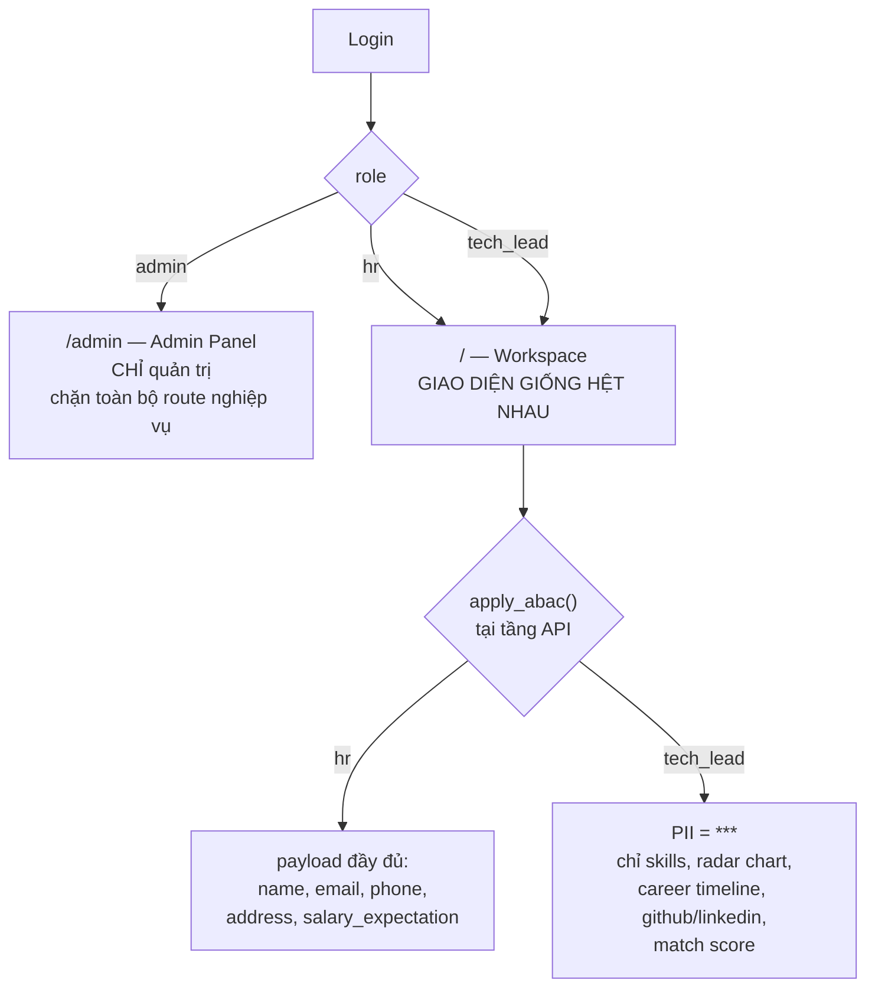

# Báo cáo: Hợp nhất hệ thống phân quyền (RBAC/ABAC) SmartATS

| | |
|---|---|
| **Trạng thái** | ✅ **Đã triển khai** trên `feature/admin-page` (sau khi merge `main`). Còn 1 việc thủ công: chạy migration `V005` — xem §6. |
| **Branch** | `feature/admin-page` |
| **Người soạn** | 24127254 – Hồ Đình Trí (Project Lead) |
| **Ngày** | 2026-08-03 |
| **Phạm vi** | `modules/auth`, `modules/shared` (ABAC), `modules/admin`, `modules/review`, `app/models`, toàn bộ `frontend/contexts` + `frontend/components/AuthGuard` |

---

## 1. Tóm tắt cho người bận (TL;DR)

Hệ thống hiện đang định nghĩa role ở **7 nơi khác nhau với 3 bộ từ vựng không khớp nhau**
(`recruiter` / `hr` / `hr_manager` cùng chỉ một người; `interviewer` / `tech_lead` cùng chỉ một người).
Hệ quả là **6 lỗi thực tế** đã tồn tại trong code, trong đó có 2 lỗi nghiêm trọng:

- Người đăng ký qua form được gán role `recruiter`, nhưng giao diện lại kiểm tra `role === "hr"`
  → **HR thật không bấm được nút ra quyết định tuyển dụng**.
- Enum Python thiếu giá trị `hr` và `tech_lead` trong khi database đã có
  → **ORM ném lỗi khi đọc tài khoản có role `hr`**.

**Đề xuất:** rút gọn về đúng **3 role — `admin`, `hr`, `tech_lead`** với quy tắc rất đơn giản:

> - `admin` đăng nhập → vào thẳng `/admin`, **chỉ** làm quản trị, bị chặn khỏi toàn bộ nghiệp vụ.
> - `hr` và `tech_lead` → dùng **chung một giao diện, chung mọi chức năng**.
>   Khác biệt duy nhất: `tech_lead` **không nhìn thấy thông tin cá nhân của ứng viên** (bị che thành `***`
>   ngay từ tầng API), chỉ thấy thông tin chuyên môn.

Khối lượng: **19 task**, chạm ~17 file, có **1 migration dữ liệu** cần chạy tay.

---

## 2. Hiện trạng — 7 nguồn định nghĩa role mâu thuẫn

| # | Vị trí | Tập role đang khai báo |
|---|---|---|
| 1 | `src/frontend/contexts/AuthContext.tsx:24` | `recruiter, interviewer, admin, tech_lead, hr` |
| 2 | `src/backend/modules/auth/domain/models.py:5` | `recruiter, interviewer, admin, tech_lead, hr` |
| 3 | `src/backend/app/models/enums.py` → `RoleType` | `recruiter, candidate, admin, interviewer` ⚠️ **thiếu `hr`, `tech_lead`** |
| 4 | Postgres enum `role_type` (sau migration `V002`) | `recruiter, candidate, admin, interviewer, tech_lead, hr` |
| 5 | `src/backend/modules/shared/domain/supabase_models.py:12` | `admin, hr_manager, tech_lead, interviewer, candidate` ⚠️ **từ vựng thứ 3** |
| 6 | `src/backend/modules/admin/application/admin_service.py:14` → `VALID_ROLES` | `recruiter, interviewer, admin` |
| 7 | `src/backend/modules/review/domain/models.py:7` → `ReviewerRole` | `hr, tech_lead` |

Ba từ vựng cùng mô tả một con người:

```
Người phụ trách tuyển dụng  →  "recruiter"   |  "hr"          |  "hr_manager"
Người review kỹ thuật       →  "interviewer" |  "tech_lead"
```

---

## 3. Sáu lỗi thực tế đang tồn tại

> Đây là lỗi đọc được trực tiếp từ code, không phải suy đoán.

### 🔴 B1 — HR thật không ra được quyết định tuyển dụng

- `auth_service.py:31` — `PUBLIC_SIGNUP_ROLE: UserRole = "recruiter"`, mọi người đăng ký đều thành `recruiter`.
- `candidate-profile/enriched/page.tsx:1708` — điều kiện hiện nút quyết định là `userRole === "hr"`.
- ⇒ Tài khoản đăng ký thật có role `recruiter`, **không bao giờ khớp** `"hr"`, nên toàn bộ khối
  "final call / approve" ở các dòng `1708, 1956, 2062, 2294, 2330` **không bao giờ render**.

### 🔴 B2 — ORM ném lỗi khi đọc user role `hr`

- Migration `V002__abac_and_candidate_details.sql:7-8` đã `ALTER TYPE role_type ADD VALUE 'tech_lead'` và `'hr'`.
- Nhưng `app/models/enums.py` → `RoleType` **không có 2 giá trị này**.
- ⇒ SQLAlchemy load một hàng `users` có `role='hr'` sẽ ném `LookupError`.
- Bằng chứng gián tiếp: `admin_service.py:28` đã phải viết workaround `cast(User.role, String)` kèm comment
  *"để KHÔNG vỡ khi DB có role ngoài enum"* — tức là lỗi này **đã được phát hiện nhưng chỉ vá phần ngọn**.

### 🟠 B3 — Admin không cấp được role `hr` / `tech_lead`

- `admin_service.py:14` — `VALID_ROLES = {"recruiter", "interviewer", "admin"}`.
- `app/admin/page.tsx:347-349` — dropdown chỉ có Recruiter / Interviewer / Admin.
- ⇒ Không có đường nào tạo ra một Tech Lead thật qua Admin Panel.

### 🟠 B4 — Từ vựng thứ ba `hr_manager` trong tầng Supabase

- `supabase_models.py:12-18` dùng `HR_MANAGER = "hr_manager"`.
- `auth_service.py:resolve_role_from_supabase()` trả thẳng chuỗi này về JWT mà không map.
- ⇒ Nếu bảng Supabase có `hr_manager`, JWT sẽ mang role không tồn tại ở bất kỳ nơi nào khác → mọi
  `require_roles()` đều từ chối.

### 🟡 B5 — `admin` đang được cấp quyền vào toàn bộ nghiệp vụ

`require_roles("hr", "recruiter", "admin")` xuất hiện ở:

- `modules/ingestion/adapters/routes.py:22`
- `modules/scheduling/adapters/routes.py:84, 97, 112, 153`
- `modules/enrichment/adapters/routes.py:26, 116`
- `modules/review/adapters/routes.py:36, 62, 72`

Và `AuthContext.tsx:179` — `canUpload = hasRole("hr", "admin")`.
⇒ Trái với định hướng "admin chỉ quản trị".

### 🟡 B6 — `tech_lead` chỉ tồn tại qua toggle giả lập ở trình duyệt

- `AppHeader.tsx:255` — menu "Demo Role" cho phép bấm đổi giữa `hr` / `tech_lead`.
- `httpClient.ts:64-65` — role đọc từ `localStorage["smartats_demo_role"]`, mặc định `"hr"`.
- ⇒ Role không đến từ JWT mà từ localStorage do client tự đặt → **không phải cơ chế bảo mật**,
  và không có tài khoản `tech_lead` thật nào trong DB.

### ⚪ B7 (phụ) — Route guard được viết nhưng không được dùng

`components/AuthGuard.tsx:8-10` khai báo `ROLE_ROUTE_MAP` nhưng biến này **không được tham chiếu ở đâu cả** —
code chết. Việc chặn route hiện chỉ làm rời rạc bên trong từng page
(`admin/page.tsx:172`, `schedule/page.tsx:228`).

---

## 4. Thiết kế đích

### 4.1 Ba role, hai nhóm hành vi



### 4.2 Nguyên tắc kiến trúc quan trọng nhất

> **Khác biệt HR ↔ Tech Lead nằm duy nhất ở `apply_abac()` phía backend.**

Frontend **không** được có nhánh layout riêng cho `tech_lead`. Nó render đúng một component tree,
chỉ là dữ liệu nhận về đã bị che sẵn.

Lý do: nếu để frontend tự ẩn thì PII **vẫn nằm trong network response** — mở DevTools là đọc được.
Che ở backend mới là biện pháp bảo mật thật, đúng tinh thần U006 trong `context.md`.

### 4.3 Ma trận quyền

| Chiều | `admin` | `hr` | `tech_lead` |
|---|:--:|:--:|:--:|
| `/admin` (users, sessions, ABAC policy, LLM logs) | ✅ **duy nhất** | ❌ | ❌ |
| `/` dashboard, `/analytics`, `/job-postings/*` | ❌ | ✅ | ✅ *(y hệt HR)* |
| `/schedule`, `/ai-agent-prompt`, `/candidate-profile/*` | ❌ | ✅ | ✅ *(y hệt HR)* |
| Upload CV, Run Sync, tạo job posting, đặt lịch phỏng vấn | ❌ | ✅ | ✅ |
| **PII ứng viên** (name, email, phone, address, salary) | ❌ | ✅ | 🚫 `***` |
| **Dữ liệu chuyên môn** (skills, radar, timeline, github, score) | ❌ | ✅ | ✅ |
| `/careers` (cổng ứng tuyển công khai) | ✅ | ✅ | ✅ |

### 4.4 Xử lý từ vựng cũ

| Giá trị cũ | Xử lý |
|---|---|
| `recruiter` | → `hr` (migration dữ liệu) |
| `interviewer` | → `tech_lead` (migration dữ liệu) |
| `hr_manager` (Supabase) | → `hr` |
| `candidate` | **Bỏ khỏi tầng ứng dụng.** Ứng viên nộp hồ sơ qua `/careers` công khai, không có tài khoản |

Giá trị enum cũ trong Postgres **không xoá** (Postgres không hỗ trợ `DROP VALUE` trên enum) —
chỉ ngừng sử dụng ở tầng ứng dụng. Điều này cũng giúp rollback an toàn.

### 4.5 Sau khi hợp nhất — chỉ còn 2 nguồn sự thật

| Tầng | File | Nội dung |
|---|---|---|
| Backend | `modules/shared/domain/roles.py` *(mới)* | `UserRole = Literal["admin","hr","tech_lead"]`, `OPERATIONAL_ROLES = ("hr","tech_lead")` |
| Frontend | `frontend/lib/rbac.ts` *(mới)* | `UserRole`, `ROLE_LABELS`, `landingPathForRole()`, `isAdminOnlyRoute()` |

Mọi module khác **import từ 2 file này**, không tự khai báo lại.

---

## 5. Kế hoạch thực thi (Progress Tracking Log)

### A. Product Technical Design

| Task ID | Component/Module | Scope of Modification | Status | Assignee |
|---|---|---|---|---|
| T-01 | `modules/shared/domain/roles.py` *(mới)* | SSOT backend: `UserRole` 3 giá trị + `OPERATIONAL_ROLES` | DONE | 24127337 – Tiến Cường |
| T-02 | `frontend/lib/rbac.ts` *(mới)* | SSOT frontend: `UserRole`, `ROLE_LABELS`, `landingPathForRole()`, `isAdminOnlyRoute()` | DONE | 24127254 – Đình Trí |

### B. Implementation — Backend

| Task ID | Component/Module | Scope of Modification | Status | Assignee |
|---|---|---|---|---|
| T-03 | `app/models/enums.py` | `RoleType` = `ADMIN / HR / TECH_LEAD` → hết `LookupError` (**B2**) | DONE | 24127337 |
| T-04 | `migrations/V005__consolidate_roles.sql` *(mới)* | `UPDATE users`: `recruiter→hr`, `interviewer→tech_lead`; đồng bộ `cv_reviews.reviewer_role`. Idempotent, không drop enum value | DONE | 24127252 – Khánh Toàn |
| T-05 | `auth/domain/models.py`, `auth/application/auth_service.py` | `PUBLIC_SIGNUP_ROLE = "hr"` (**B1**); `resolve_role()` fallback → `tech_lead`; map `hr_manager→hr` khi đọc Supabase (**B4**) | DONE | 24127337 |
| T-06 | `shared/domain/supabase_models.py` | Xoá `hr_manager` / `recruiter` / `candidate`, thống nhất 3 role (**B4**) | DONE | 24127252 |
| T-07 | ingestion / scheduling / enrichment / job-posting routes | `require_roles("hr","recruiter","admin")` → `require_roles("hr","tech_lead")`; **gỡ `admin`** khỏi mọi endpoint nghiệp vụ (**B5**) | DONE | 24127337 |
| T-08 | `review/adapters/routes.py` | Đọc: cả 2 role. Ghi: `hr` → `hr_decision`, `tech_lead` → `tl_decision` | DONE | 24127382 – Nhật Hoàng |
| T-09 | `shared/infrastructure/abac.py` | Policy còn 3 key; đổi `tech_lead` sang **default-deny + whitelist** field kỹ thuật | DONE | 24127337 |
| T-10 | `enrichment/adapters/routes.py` + các route trả profile | Áp `apply_abac()` **nhất quán** ở mọi endpoint trả PII, không chỉ một chỗ ở `routes.py:124` | DONE | 24127337 |
| T-11 | `admin/application/admin_service.py` | `VALID_ROLES = {"admin","hr","tech_lead"}` (**B3**); bỏ workaround `cast(role, String)` | DONE | 24127337 |

### C. Implementation — Frontend

| Task ID | Component/Module | Scope of Modification | Status | Assignee |
|---|---|---|---|---|
| T-12 | `contexts/AuthContext.tsx` | Re-export từ `rbac.ts`; `canUpload = hasRole("hr","tech_lead")`; `DEMO_USER.role = "hr"`; gỡ `devSetRole` | DONE | 24127254 |
| T-13 | `components/AuthGuard.tsx` | Xoá `ROLE_ROUTE_MAP` chết (**B7**); luật duy nhất: admin ở ngoài `/admin` → `router.replace("/admin")` | DONE | 24127254 |
| T-14 | `components/AppHeader.tsx`, `LeftSidebar.tsx` | `ROLE_LABELS` còn 3; **gỡ menu "Demo Role"** (**B6**); nút Admin Panel chỉ hiện với admin | DONE | 24127254 |
| T-15 | `app/candidate-profile/enriched/page.tsx` | **Hợp nhất layout**: xoá nhánh `if (hasRole("tech_lead"))` ở dòng 2637, dùng chung layout với HR + giữ banner ABAC; sửa fallback `user?.role \|\| "hr"` đang che lỗi thật | DONE | 24127382 |
| T-16 | `app/admin/page.tsx` | Dropdown role → `Admin / HR / Tech Lead`; type `role` khớp `UserRole` | DONE | 24127254 |
| T-17 | `services/httpClient.ts` | Gỡ `getStoredDemoRole()` và key `smartats_demo_role` — role chỉ đến từ JWT (**B6**) | DONE | 24127337 |

### D. Document Specifications Sync

| Task ID | Component/Module | Scope of Modification | Status | Assignee |
|---|---|---|---|---|
| T-18 | `context.md` §3, `database_design.md` | Chốt 3 stakeholder role; cập nhật `role_type` và ma trận ABAC | DONE | 24127252 |
| T-19 | `tests/test_rbac_matrix.py` *(mới)*, `test_admin_router.py`, `test_auth_basics.py` | Test ma trận 3 role × endpoint (403 đúng chỗ); test `apply_abac` che đúng PII và **không** che field kỹ thuật | DONE | 24127337 |

**Phân bổ:** 24127337 (Security & DevOps) 10 task · 24127254 (Project Lead) 5 task · 24127252 (Data) 3 task · 24127382 (AI) 2 task.

---

## 5b. Phát sinh trong lúc triển khai — 5 lỗi bảo mật tìm thêm

Năm lỗi dưới đây **không có trong bản đề xuất ban đầu**; chúng lộ ra khi sửa T-10/T-11 và đều
làm vô hiệu hoá chính cơ chế phân quyền mà báo cáo này xây dựng, nên đã được xử lý luôn.

Ngoài ra 2 việc dọn dẹp nhỏ: `init_db.sql` còn khai `role_type` với từ vựng cũ (đã sửa), và
`*.tsbuildinfo` — build artifact của TypeScript — bị commit vào git nên **mỗi lần merge lại đẻ ra
một conflict vô nghĩa** (đã thêm vào `.gitignore` và untrack).

### 🔴 B8 — Che PII **ghi đè** dữ liệu gốc dùng chung

`enrichment/adapters/routes.py` (bản cũ) gán bản đã che ngược lại vào `enrichment`,
mà `enrichment` chính là object nằm trong dict `candidate_enrichments`:

```python
enrichment.enriched_profile = enrichment.enriched_profile.__class__(**masked)
```

⇒ Chỉ cần **một** Tech Lead mở hồ sơ, dữ liệu thật của ứng viên bị thay bằng `***`
**vĩnh viễn với cả HR**. Đây là mất dữ liệu, không chỉ là lỗi hiển thị.
**Đã sửa:** `apply_abac` trả bản sao, route dựng object mới; có test
`test_abac_does_not_mutate_the_source`.

### 🔴 B9 — WebSocket trả toàn bộ PII mà **không xác thực gì cả**

`@router.websocket("/ws/v1/analysis/{candidate_uuid}")` không kiểm tra token, không kiểm tra role,
và gửi thẳng `enriched_profile.model_dump()`. Bất kỳ ai biết `candidate_uuid` đều kéo được
toàn bộ hồ sơ — kể cả người chưa đăng nhập.

**Đã sửa:** thêm handshake — frame đầu tiên phải là `{"token": "<access token>"}` (gửi qua
message chứ không qua query string để token không lọt vào access log), server trả
`{"status":"AUTHENTICATED"}` rồi mới gửi dữ liệu; sai/thiếu token → đóng với code `4401`.
Mỗi socket được gắn role, worker broadcast bản đã che theo đúng role của từng socket.
Test: `test_websocket_rejects_connection_without_token`, `test_websocket_masks_pii_for_tech_lead`.

### 🔴 B11 — Nút khoá tài khoản trong Admin Panel không có tác dụng

Cột `users.is_approved` **không được đọc ở bất kỳ luồng đăng nhập nào**. Admin bấm khoá một
tài khoản → người đó vẫn đăng nhập bình thường. `AdminService` thậm chí có sẵn safety rail
"không cho tự khoá tài khoản admin của chính mình", tức là tính năng này được thiết kế để
hoạt động — chỉ là chưa bao giờ được nối vào.

**Đã sửa:** `login_with_email_password` và `login_with_google` từ chối tài khoản chưa duyệt /
bị khoá. Tài khoản tạo tự động từ Google được set `is_approved=True` ngay lúc tạo (email đã
qua allowlist Supabase/.env — đó chính là bước duyệt), nếu không người dùng vừa tạo sẽ bị
chính check này chặn. Test: `test_suspended_account_cannot_log_in`.

### 🔴 B12 — Hạ quyền / khoá tài khoản không thu hồi phiên đang mở

Role nằm **trong access token**. `AdminService.update_user()` chỉ `UPDATE users` rồi thôi, nên
người vừa bị hạ từ `admin` xuống `tech_lead`, hoặc vừa bị khoá, **vẫn giữ nguyên quyền cũ** cho
tới khi token hết hạn (mặc định 60 phút).

**Đã sửa:** đổi role hoặc đổi trạng thái duyệt sẽ set `is_revoked = TRUE` cho toàn bộ phiên đang
mở của user đó; số phiên bị thu hồi được ghi vào `audit_logs`.

### 🟠 B10 — Token thiếu claim `role` được mặc định thành role có quyền

`jwt_service.py` cũ: `role=payload.get("role", "interviewer")`. Token hỏng/thiếu claim
được âm thầm cấp một role thật.
**Đã sửa:** thiếu hoặc lạ → `ValueError` → 401. Đồng thời `resolve_role()` (fallback khi
chưa cấu hình Supabase) trước đây trả `interviewer` cho **mọi** email lạ — nghĩa là bất kỳ ai có
tài khoản Google cũng đăng nhập được; nay email không khớp `ADMIN_EMAILS` /
`RECRUITER_EMAIL_DOMAINS` bị từ chối.

---

## 5c. Hai điểm làm khác bản đề xuất

1. **Giữ lại `cast(User.role, String)` trong `admin_service.get_users()`** (đề xuất T-11 là bỏ).
   Lý do: đây là màn hình duy nhất admin dùng để sửa role hỏng — nó phải load được **kể cả khi
   V005 chưa chạy**. Bỏ đi thì lúc cần nhất lại không mở được.

2. **Không chặn `tech_lead` khỏi route nào** (bản đề xuất đầu tiên có chặn `/schedule`,
   `/job-postings`…). Theo chốt của team: hr và tech_lead dùng chung hoàn toàn, khác biệt chỉ ở
   dữ liệu. `AuthGuard` vì vậy chỉ còn đúng một luật: admin ở ngoài `/admin` → đẩy về `/admin`.

---

## 6. Rủi ro & lưu ý khi triển khai

| Rủi ro | Mức | Giảm thiểu |
|---|---|---|
| **T-04 chạy `UPDATE` trên bảng `users`** | 🔴 Cao | Migration viết idempotent; kèm câu kiểm tra `SELECT role, count(*) FROM users GROUP BY role` chạy **trước và sau**. Không tự động apply — người phụ trách DB quyết định thời điểm |
| Tài khoản đang đăng nhập có role cũ trong JWT | 🟠 TB | JWT còn hiệu lực vẫn mang `recruiter`/`interviewer`. Sau migration cần **revoke session** qua Admin Panel (`user_sessions.is_revoked`) hoặc chờ token hết hạn |
| Gỡ `admin` khỏi route nghiệp vụ có thể làm hỏng luồng test hiện tại | 🟡 Thấp | T-19 viết trước/song song để bắt ngay |
| ABAC đổi từ blacklist sang whitelist có thể che nhầm field hợp lệ | 🟡 Thấp | Liệt kê whitelist dựa đúng trên `EnrichedProfile` schema; test T-19 phủ từng field |

---

## 7. Việc còn lại — cần team quyết / thực hiện

### 🔴 Bắt buộc trước khi chạy hệ thống

**Chạy migration `V005__consolidate_roles.sql`.** Code đã đổi `RoleType` còn 3 giá trị; nếu DB còn
hàng mang `recruiter`/`interviewer` thì SQLAlchemy sẽ ném `LookupError` khi đọc. Migration đã viết
sẵn, idempotent, **chưa được chạy** — người phụ trách DB (24127252 – Khánh Toàn) quyết định thời điểm.
Kiểm tra trước và sau bằng câu SQL kèm trong file.

Sau khi chạy, cân nhắc thu hồi phiên đang mở: `UPDATE user_sessions SET is_revoked = TRUE;`
(không bắt buộc — backend đã tự quy đổi role cũ trong token, xem `roles.normalise_role`).

### 🟠 Cần chốt

1. **Danh sách field PII cần che.** ABAC nay là **default-deny**: mọi field không nằm trong
   `TECH_LEAD_VISIBLE_FIELDS` đều bị che. Cần rà soát whitelist hiện tại
   (`modules/shared/infrastructure/abac.py`) xem có field chuyên môn nào bị che nhầm không.
   → **24127337 – Tiến Cường.**

   Lưu ý một điểm chưa nhất quán, cố ý giữ nguyên hành vi cũ để không làm hỏng luồng Run Sync:
   `github_username` và `linkedin_url` **vẫn hiển thị** cho Tech Lead. Che họ tên nhưng vẫn đưa link
   hồ sơ cá nhân thì việc chống thiên vị chỉ còn nửa vời — team cần quyết có che nốt hay không.

2. **Quyền ra quyết định review.** Giữ nguyên thiết kế sẵn có (`ReviewerRole = hr | tech_lead`):
   HR ghi `hr_decision` và chốt final call (`POST /api/review/{uuid}/resolve` nay chỉ `hr` gọi được),
   Tech Lead ghi `tl_decision`. Đây là *ai ký vào ô nào*, không phải *giao diện khác nhau*.
   → **24127382 – Nhật Hoàng xác nhận.**

3. **Tài khoản `tech_lead` để test.** Toggle "Demo Role" đã bị gỡ (nó cho phép tự nâng quyền bằng
   localStorage), nên giờ cần một tài khoản `tech_lead` thật: seed thêm trong
   `scripts/seed_admin.py` hay tạo qua Admin Panel? → **24127254 – Đình Trí quyết.**

4. **`RECRUITER_EMAIL_DOMAINS` trong `.env`.** Biến này nay quyết định email nào được cấp role `hr`
   khi đăng nhập Google mà chưa cấu hình Supabase. Email không khớp sẽ **bị từ chối** (trước đây được
   cấp `interviewer`). Cần điền domain của team vào `.env` để tránh khoá nhầm nhau lúc dev.

---

## 8. Phụ lục — bảng tra nhanh file bị chạm

| File | Task |
|---|---|
| `src/backend/modules/shared/domain/roles.py` *(mới)* | T-01 |
| `src/frontend/lib/rbac.ts` *(mới)* | T-02 |
| `src/backend/app/models/enums.py` | T-03 |
| `src/backend/migrations/V005__consolidate_roles.sql` *(mới)* | T-04 |
| `src/backend/modules/auth/domain/models.py` | T-05 |
| `src/backend/modules/auth/application/auth_service.py` | T-05 |
| `src/backend/modules/shared/domain/supabase_models.py` | T-06 |
| `src/backend/modules/ingestion/adapters/routes.py` | T-07 |
| `src/backend/modules/scheduling/adapters/routes.py` | T-07 |
| `src/backend/modules/enrichment/adapters/routes.py` | T-07, T-10 |
| `src/backend/modules/review/adapters/routes.py` | T-08 |
| `src/backend/modules/shared/infrastructure/abac.py` | T-09 |
| `src/backend/modules/admin/application/admin_service.py` | T-11 |
| `src/frontend/contexts/AuthContext.tsx` | T-12 |
| `src/frontend/components/AuthGuard.tsx` | T-13 |
| `src/frontend/components/AppHeader.tsx` | T-14 |
| `src/frontend/components/LeftSidebar.tsx` | T-14 |
| `src/frontend/app/candidate-profile/enriched/page.tsx` | T-15 |
| `src/frontend/app/admin/page.tsx` | T-16 |
| `src/frontend/services/httpClient.ts` | T-17 |
| `context.md`, `database_design.md` | T-18 |
| `src/backend/tests/*` | T-19 |
