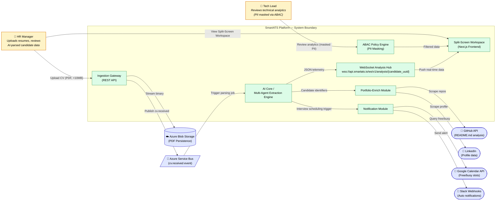

# Stakeholders
**Written by:** 24127252 - Nguyễn Khánh Toàn

**Edited by:** 24127254 - Hồ Đình Trí

**Reviewed by:** 24127382 - Trần Nhật Hoàng

## 1. System Context Diagram

The diagram below positions **SmartATS** as the central system under design, bounded by a single dashed-line boundary that separates internal components from external actors and third-party systems. Two human actor roles sit on the left of the boundary: the **HR Manager**, who drives the core ingestion and review workflow, and the **Tech Lead**, who consumes analytical output under an ABAC-restricted, PII-masked view. On the right, the diagram maps every external system the platform integrates with: **Azure Blob Storage** and **Azure Service Bus** form the asynchronous ingestion backbone; **GitHub** and **LinkedIn** are scraped by the Portfolio-Enrich module to augment candidate profiles; **Google Calendar API** is queried for interviewer availability; and **Slack Webhooks** deliver automated notifications back to the hiring team. The bidirectional WebSocket channel (`wss://api.smartats.io/ws/v1/analysis/{candidate_uuid}`) is shown explicitly, since it is the primary real-time data path between the AI Core and the Split-Screen Workspace UI. This diagram establishes the system's outer boundary and integration surface, serving as the baseline reference for all subsequent Use Case and Sequence diagrams in this document.

## 2. Stakeholders Matrix

| **STT** | **Stakeholder** | **Type** | **Description** |
| --- | --- | --- | --- |
| 1 | Project Sponsor | Internal / Business | Funds and oversees the SmartATS initiative; approves scope, budget, and final delivery acceptance. |
| 2 | HR Manager | Primary Human Actor | Uploads candidate resumes, monitors ingestion status, and reviews AI-parsed analytical output via the Split-Screen Workspace. Holds full visibility into candidate PII. |
| 3 | Tech Lead | Secondary Human Actor | Reviews technical-skill analytics (Radar Chart, career timeline) for hiring decisions; operates under ABAC policy with PII fields masked/redacted. |
| 4 | Candidate (Data Subject) | Indirect Stakeholder | Submits CV data indirectly through the recruitment process; does not interact with the system directly but is the subject of all processed data, governed by data-privacy obligations. |
| 5 | Autonomous AI Analytics Engine (AI Core) | Internal System Component | Multi-agent backend service that parses ingested PDFs, extracts structured candidate metadata, and streams results to the frontend via WebSocket. |
| 6 | Azure Blob Storage | External System | Cloud persistence layer storing raw candidate PDF binaries under a private container, referenced by a deterministic UUID-mapped URL. |
| 7 | Azure Service Bus | External System | Asynchronous message broker decoupling the ingestion API from the downstream AI parsing pipeline via the `cv.received` event. |
| 8 | GitHub | External Third-Party System | Source queried by the Portfolio-Enrich module to analyze public repositories and README.md content for technical-skill corroboration. |
| 9 | LinkedIn | External Third-Party System | Source queried by the Portfolio-Enrich module to enrich candidate profiles with professional history data. |
| 10 | Google Calendar API | External Third-Party System | Queried by the Notification module to identify interviewer free/busy slots for scheduling. |
| 11 | Slack Webhooks | External Third-Party System | Outbound channel used by the Notification module to push automated hiring-pipeline alerts to internal HR/recruiting channels. |
| 12 | System Administrator | Internal Operational Actor | Manages ABAC policy configuration, system uptime, and infrastructure scaling (Azure resources, message queue throughput). |

