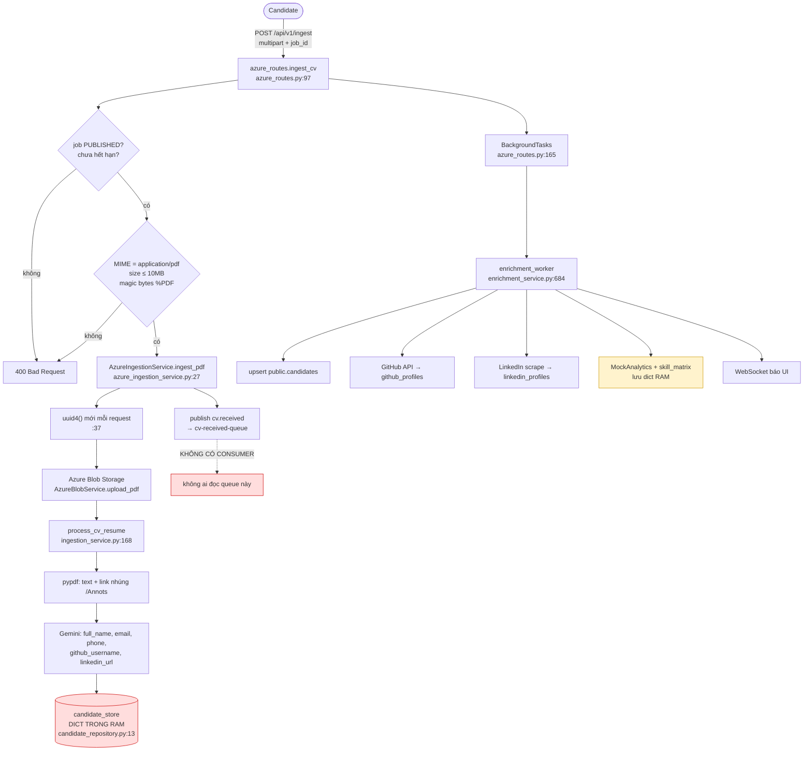
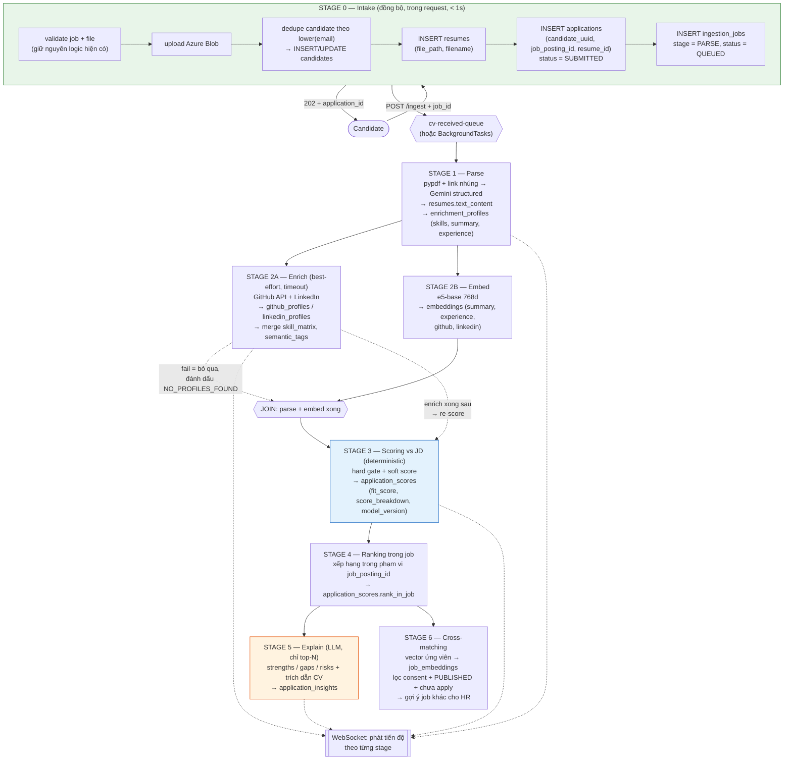

# Pipeline xử lý CV khi candidate nộp hồ sơ


**Phạm vi khảo sát:** `feature/admin-page` @ `2e22bb7` (luồng ingestion đang chạy) + `ai-agent` @ `4c3be11` (tầng embedding/ranking)
**Schema tham chiếu:** `supabase guide.md` (root nhánh `feature/admin-page`)
**Liên quan:** [`ai-agent-branch-review.md`](ai-agent-branch-review.md) · [`merge-ai-agent-into-admin-page-report.md`](merge-ai-agent-into-admin-page-report.md) · [`ai-agent-todo.md`](ai-agent-todo.md)

Tài liệu này gồm 4 phần: **(1)** luồng đang chạy thật, **(2)** pipeline mong muốn còn thiếu gì, **(3)** điểm dở của pipeline đó, **(4)** pipeline đề xuất + SQL.

---

## 1. Luồng hiện tại (as-is)

### 1.1. Sơ đồ



### 1.2. Đối chiếu với 7 bước mong muốn

| # | Bước mong muốn                       | Hiện trạng                                             | Ở đâu                                                                                                                                          |
| - | --------------------------------------- | -------------------------------------------------------- | ------------------------------------------------------------------------------------------------------------------------------------------------- |
| 1 | Nộp CV theo link job → lưu Azure     | ✅**Đủ**                                         | `azure_routes.py:97`, `azure_blob_service.py`                                                                                                 |
| 2 | Parser chạy ngầm                      | ⚠️**Có, nhưng chạy đồng bộ trong request** | `azure_ingestion_service.py:60` gọi `process_cv_resume` ngay, không phải background                                                        |
| 3 | Gọi AI phân tích                     | ⚠️**Chỉ trích thông tin liên hệ**           | `ingestion_service.py:115` Gemini chỉ lấy name/email/phone/github/linkedin — **không** phân tích skills, kinh nghiệm, điểm mạnh |
| 4 | Enrich GitHub + LinkedIn                | ✅**Đủ**                                         | `enrichment_service.py:684`, `github_ingestion_service.py`, `linkedin_ingestion_service.py`                                                 |
| 5 | Scoring độ matching với JD           | ❌**Chưa có gì**                                | —                                                                                                                                                |
| 6 | Ranking giữa ứng viên trong job      | ❌**Không thể làm được**                     | không có bản ghi nào nối candidate ↔ job (xem 2.1)                                                                                          |
| 7 | Cross-matching → đề xuất job cho HR | ❌**Chưa có gì**                                | —                                                                                                                                                |

**Tóm lại: 2/7 đủ, 2/7 làm một nửa, 3/7 chưa có.**

---

## 2. Pipeline mong muốn còn thiếu gì

Mỗi mục dưới đây đều đã kiểm chứng bằng cách đọc code, không phải suy đoán.

### 2.1. `job_id` bị đánh rơi — đây là lỗ hổng chặn bước 6

> ✅ **Đã xử lý (2026-08-10, nhánh `feature/admin-page`):** Stage 0 persistence đã được cài — `ingest_pdf` giờ upsert `candidates` → INSERT `resumes` → INSERT `applications (candidate_uuid, job_posting_id, resume_id, status='SUBMITTED')` ngay trong request khi có `job_id` (xem `modules/ingestion/infra/application_repository.py` và `AzureIngestionService._persist_stage0`). Response trả thêm `resume_id` + `application_id`. Upload nội bộ không có `job_id` chỉ ghi `candidates` + `resumes`. Nội dung bên dưới giữ lại làm bối cảnh lịch sử.

`job_id` đi từ form vào tận `CandidateRecord`, rồi **dừng ở đó**:

```python
# enrichment_service.py:737 — đọc ra...
job_id = candidate.job_id if candidate else None

# enrichment_service.py:740 — ...rồi KHÔNG truyền vào
candidate_created = await candidate_service.ensure_candidate_exists(
    candidate_uuid, cv_file_path,
    full_name=..., email=..., phone=..., linkedin_url=..., github_username=...,
)   # ← không có job_id
```

`ensure_candidate_exists` (`supabase_candidate_service.py:25`) cũng không có tham số nào nhận job.

Grep toàn repo: **không có một câu INSERT nào vào bảng `applications`.**

→ Hệ quả: DB không hề biết ứng viên nào nộp vào job nào. Bước "ranking giữa các ứng viên apply vào job đó" **không có dữ liệu để chạy**, dù bảng `applications` đã tồn tại sẵn với đầy đủ trường.

### 2.2. `resumes` không bao giờ được ghi

> ✅ **Đã xử lý (2026-08-10):** cùng đợt với 2.1 — mỗi upload giờ INSERT một dòng `resumes` (filename + blob URL) trước khi tạo `applications`.

Không có INSERT nào vào `public.resumes`. Mà `applications.resume_id` là `NOT NULL` với FK sang `resumes(id)` → kể cả có muốn tạo `applications` cũng không tạo được.

### 2.3. Dữ liệu nằm trong RAM

```python
# candidate_repository.py:13
candidate_store: Dict[str, CandidateRecord] = {}
github_data_store: Dict[str, Dict] = {}
linkedin_data_store: Dict[str, Dict] = {}
```

`enrichment_service.py` cũng có `candidate_enrichments: Dict` giữ trạng thái enrichment.

→ Restart backend là mất; chạy 2 worker/replica thì worker này không thấy dữ liệu của worker kia; `enrichment_worker` gọi `get_candidate()` từ RAM nên **bắt buộc phải chạy cùng process** với request upload.

### 2.4. Azure Service Bus chỉ để trang trí

`azure_service_bus_service.py:11` khai báo `cv-received-queue` và có `publish_cv_received_event`. Nhưng grep `receive` / `ServiceBusReceiver` / consumer trên toàn `src/backend/modules`: **không có ai đọc queue này**. Module `notification/` rỗng hoàn toàn.

Việc bất đồng bộ thật sự đang chạy bằng `BackgroundTasks` in-process (`azure_routes.py:165`) → không retry, không dead-letter, backend crash giữa chừng là mất CV không dấu vết.

### 2.5. Không sinh embedding trong luồng upload

Không chỗ nào trong `modules/` gọi `EmbeddingService`. Hai bảng `enrichment_profiles` và `embeddings` **không được ghi từ luồng thật** (chỉ `github_profiles` / `linkedin_profiles` / `candidates` được ghi).

→ Mọi thứ semantic phía sau (scoring, ranking, cross-matching, agent search) đều không có nguồn dữ liệu.

### 2.6. Không có scoring vs JD

`jobs_posting` đã có sẵn `must_have_skills`, `nice_to_have_skills`, `requirements`, `description`, `seniority_level`, `salary_min/max`. **Không dòng code nào đọc chúng để chấm điểm.** Chỉ có một comment trong `V004__application_screening.sql:6` nhắc tới "Fit Score".

### 2.7. Không có chỗ lưu điểm theo từng job

`enrichment_profiles.match_confidence_score` là **một số duy nhất cho mỗi ứng viên**, không gắn với job nào. Một người apply 3 job thì cần 3 điểm khác nhau — schema hiện tại không chứa được.

### 2.8. Không có chỗ lưu embedding của JD

```sql
CREATE TABLE public.embeddings (
  enrichment_profile_id uuid NOT NULL,   -- ← FK sang enrichment_profiles
  ...
);
```

Cột này `NOT NULL` → bảng chỉ chứa được vector **của ứng viên**. Không có bảng nào chứa vector của JD → bước cross-matching (lấy vector ứng viên query ngược sang job) không có nguồn để query.

### 2.9. Không dedupe ứng viên

```python
# azure_ingestion_service.py:37
candidate_uuid = str(uuid.uuid4())
```

Sinh UUID mới **mỗi request**. Cùng một người nộp lại CV, hoặc apply 2 job → thành 2–3 `candidates` khác nhau, enrichment chạy lại từ đầu, HR nhìn thấy trùng người.

### 2.10. Không idempotency, không version model

Upload trùng 2 lần → chạy 2 lần toàn bộ pipeline. Không lưu `model_name` / `prompt_version` cùng kết quả → đổi model embedding hoặc sửa JD thì không biết bản ghi nào cần re-score.

---

## 3. Điểm dở về mặt thiết kế của pipeline đang mô tả

Phần 2 nói về *cái chưa làm*. Phần này nói về *cách sắp xếp các bước*.

### 3.1. Thứ tự "phân tích AI → enrich" bị ngược phụ thuộc

Mô tả đặt "gọi AI phân tích" trước "enrich", nhưng phân tích đầy đủ (skill matrix, độ sâu kinh nghiệm) lại cần dữ liệu GitHub/LinkedIn. Nếu làm tuyến tính thì hoặc phân tích thiếu, hoặc phải phân tích 2 lần.

→ Nên là **fan-out/fan-in**: parse xong thì rẽ 2 nhánh song song (enrich / embed), có **điểm join rõ ràng** trước khi scoring.

### 3.2. Enrich chặn scoring

LinkedIn scrape dùng Playwright/Apify — chậm (chục giây đến phút) và hay fail (đổi layout, chặn bot, ứng viên không có LinkedIn).

Nếu scoring phải chờ enrich xong thì một ứng viên không có LinkedIn sẽ **kẹt vô hạn**, HR không bao giờ thấy điểm.

→ Enrich phải là **best-effort**: có timeout, fail thì đánh dấu `NO_PROFILES_FOUND` và scoring vẫn chạy tiếp với dữ liệu CV. Enrich xong sau thì **re-score**, không chặn.

### 3.3. Để LLM chấm điểm trực tiếp là lựa chọn tệ

Nếu mỗi cặp (CV, JD) đều gọi LLM để ra con số:

- **Đắt và chậm** — 500 ứng viên × 5 job = 2.500 lần gọi LLM.
- **Không deterministic** — chạy lại ra điểm khác, ứng viên A hôm nay 78 mai 71.
- **Không audit được** — HR hỏi "vì sao bạn này 72 mà bạn kia 68?" thì không trả lời được.
- **Không so sánh được giữa các ứng viên** — LLM chấm từng người riêng lẻ, không có thang chung.

→ Tách **2 tầng**: tầng chấm điểm rẻ + deterministic (rule + vector) chạy cho **tất cả**; LLM **chỉ diễn giải top-N**, không được quyết định con số.

### 3.4. Ranking theo score thô là chưa đủ

- Score chỉ có ý nghĩa **trong phạm vi một job** — không so được điểm 80 ở job A với 80 ở job B.
- Cần **tie-break** rõ ràng (ví dụ: fit_score → must-have coverage → thời gian nộp) để thứ hạng ổn định.
- Cần lưu **evidence** kèm mỗi điểm, nếu không HR không dám tin và cũng không giải trình được khi ứng viên khiếu nại.

### 3.5. Cross-matching bỏ qua consent và ABAC

Bảng `applications` đã có `consent_data_sharing` và `consent_at` — nó tồn tại **chính vì** việc đem hồ sơ của ứng viên đi giới thiệu cho job khác.

Đề xuất job ngược mà không lọc consent là dùng dữ liệu sai mục đích ứng viên đồng ý. Ngoài ra còn phải: chỉ gợi ý job `PUBLISHED` chưa hết hạn, loại job họ đã apply, và tôn trọng ABAC/PII masking đã có (`modules/shared/infrastructure/abac.py`).

### 3.6. Không có khả năng chạy lại

JD được sửa (`jobs_posting.updated_at`), hoặc đổi model embedding → toàn bộ điểm cũ thành sai. Không có `model_version` / trạng thái stage thì không biết cái nào cần tính lại.

---

## 4. Pipeline đề xuất

Nguyên tắc thiết kế:

1. **Ghi DB ngay ở request đầu tiên** — không giữ gì quan trọng trong RAM.
2. **Fan-out/fan-in có điểm join rõ ràng** — enrich và embed chạy song song.
3. **Enrich là best-effort** — không chặn scoring.
4. **Điểm số do công thức quyết định, LLM chỉ giải thích.**
5. **Mọi kết quả AI đều lưu kèm version model** để re-score được.

### 4.1. Sơ đồ



### 4.2. Chi tiết từng stage

#### Stage 0 — Intake (đồng bộ, trong request)

Giữ nguyên toàn bộ validate đang có (`azure_routes.py:19,23,139`), chỉ **thay phần lưu**:

| Thay vì                           | Làm                                                                              |
| ---------------------------------- | --------------------------------------------------------------------------------- |
| `save_candidate()` vào dict RAM | `INSERT`/`UPDATE` `public.candidates`, dedupe theo `lower(email)`         |
| không ghi gì                     | `INSERT public.resumes`                                                         |
| `job_id` chỉ nằm trong RAM     | `INSERT public.applications (candidate_uuid, job_posting_id, resume_id)`        |
| không có trạng thái            | `INSERT public.ingestion_jobs (application_id, stage='PARSE', status='QUEUED')` |

Trả `202 Accepted` kèm `application_id` (thay vì chỉ `candidate_uuid`) để frontend theo dõi đúng đơn ứng tuyển.

**Đây là thay đổi quan trọng nhất — nó mở khoá bước 5, 6, 7.**

#### Stage 1 — Parse (async)

Giữ `extract_text_and_links_from_pdf` (`ingestion_service.py:54`) và `parse_cv_with_gemini` (`:115`), nhưng **mở rộng prompt** để lấy thêm:

```
skills[], experiences[{company, position, duration, highlights[]}],
education[], summary, seniority_hint, years_of_experience
```

Ghi kết quả vào `resumes.text_content` và `enrichment_profiles` (`skills`, `summary`, `experience`).

> Lưu ý: dùng structured output của provider thay vì tự parse JSON bằng regex. `GroqProvider.invoke(..., response_model=...)` bên nhánh `ai-agent` đã làm đúng cách này.

#### Stage 2A — Enrich (song song, best-effort)

Giữ nguyên `enrichment_worker`. Chỉ thêm:

- **Timeout cứng** cho LinkedIn scrape (ví dụ 60s), quá thì `NO_PROFILES_FOUND`.
- Merge kết quả vào `enrichment_profiles.skill_matrix`, `semantic_tags`, `github_summary`, `linkedin_summary`.
- **Không chặn Stage 3.** Khi enrich xong muộn thì bắn re-score.

#### Stage 2B — Embed (song song)

Dùng `EmbeddingService` có sẵn ở nhánh `ai-agent` (`intfloat/multilingual-e5-base`, 768 chiều). Sinh 2–4 vector cho mỗi ứng viên:

| `source_type` | Nội dung                                            |
| --------------- | ---------------------------------------------------- |
| `summary`     | `passage: {enrichment_profiles.summary}`           |
| `experience`  | `passage: {mô tả kinh nghiệm gộp}`             |
| `github`      | `passage: {tóm tắt repo/ngôn ngữ}` — nếu có |
| `linkedin`    | `passage: {tóm tắt profile}` — nếu có         |

Ghi vào `public.embeddings`.

> **Bắt buộc dùng prefix `passage:` / `query:`** — mô hình E5 yêu cầu; thiếu prefix thì cosine sai lệch đáng kể.

#### Stage 3 — Scoring vs JD (deterministic, không LLM)

**Hard gate** (trượt là loại, không tính điểm mềm):

| Tiêu chí                            | Nguồn ứng viên                        | Nguồn JD                         |
| ------------------------------------- | ---------------------------------------- | --------------------------------- |
| Must-have skills coverage ≥ ngưỡng | `enrichment_profiles.skills`           | `jobs_posting.must_have_skills` |
| Work authorization                    | `applications.work_authorization`      | —                                |
| Khoảng lương có giao nhau         | `applications.expected_salary_min/max` | `jobs_posting.salary_min/max`   |
| Thời gian có thể bắt đầu        | `applications.availability_bucket`     | —                                |

**Soft score** (0–100, tổng có trọng số):

| Thành phần        | Trọng số gợi ý | Cách tính                                                                                |
| ------------------- | ------------------ | ------------------------------------------------------------------------------------------ |
| Semantic summary    | 0.30               | cosine(`job_embeddings.summary`, `embeddings.summary`)                                 |
| Semantic experience | 0.25               | cosine(`job_embeddings.requirements`, `embeddings.experience`)                         |
| Skill overlap       | 0.25               | Jaccard(`enrichment_profiles.skills`, must + nice-to-have, có trọng số must cao hơn) |
| Seniority match     | 0.10               | khớp`experience_bucket` ↔ `jobs_posting.seniority_level`                             |
| Tín hiệu enrich   | 0.10               | GitHub activity / skill_matrix —**0 nếu chưa enrich**, không phạt ứng viên    |

Lưu vào `application_scores` kèm `score_breakdown jsonb` (từng thành phần) và `model_version`.

> Trọng số phải để ở config, không hardcode — HR sẽ muốn chỉnh theo từng job.

#### Stage 4 — Ranking trong job

Xếp hạng trong phạm vi `job_posting_id`:

```
ORDER BY fit_score DESC,
         must_have_coverage DESC,
         submitted_at ASC      -- tie-break: nộp sớm ưu tiên
```

Ghi `rank_in_job`. Tính lại khi có đơn mới hoặc khi re-score.

Có thể tái sử dụng ý tưởng chuẩn hoá + weighted fusion trong `RankingService.fuse_and_rank` (nhánh `ai-agent`) thay vì viết mới.

#### Stage 5 — Explain (LLM, chỉ top-N)

Chỉ chạy cho top 10–20 của mỗi job:

- Input: `score_breakdown` + `enrichment_profiles` + đoạn CV liên quan.
- Output: `strengths[]`, `gaps[]`, `risks[]`, mỗi ý **kèm trích dẫn từ CV** làm bằng chứng.
- Lưu `application_insights` kèm `llm_model`.

**LLM không được sửa `fit_score`.** Nó chỉ đọc điểm và giải thích — như vậy HR luôn giải trình được, và điểm luôn tái lập được.

#### Stage 6 — Cross-matching (đề xuất job cho HR)

Lấy `embeddings` của ứng viên → query ngược sang `job_embeddings` (pgvector cosine) → top-K job.

Bộ lọc bắt buộc:

- `applications.consent_data_sharing = true`
- `jobs_posting.status = 'PUBLISHED'` và chưa hết hạn
- loại các job ứng viên đã apply
- áp `abac.py` khi trả về cho từng role

Output cho HR: "Ứng viên này mạnh về X, Y — ngoài job đang apply, còn phù hợp với job A (82%), job B (76%)."

### 4.3. Realtime

Đã có sẵn `websocket_manager.py` và WebSocket route trong `modules/enrichment/adapters/routes.py`. Chỉ cần phát event theo từng stage:

```
PARSING → PARSED → ENRICHING → EMBEDDED → SCORED → RANKED → EXPLAINED
```

Trạng thái đọc từ `ingestion_jobs` (DB) thay vì dict RAM → reload trang hay restart server vẫn đúng.

---

## 5. SQL đề xuất

### 5.1. Đã có sẵn — không cần viết lại

Theo `supabase guide.md`: `users`, `candidates`, `resumes`, `jobs_posting`, `applications` (đã đủ trường sàng lọc từ `V004`), `enrichment_profiles`, `embeddings`, `github_profiles`, `linkedin_profiles`, `cv_reviews`, `abac_policies`, `audit_logs`, `llm_usage_logs`.

### 5.2. Bảng cần thêm

```sql
-- ============================================================
-- 1. Embedding của JD — hiện chưa có chỗ nào chứa
-- ============================================================
CREATE TABLE public.job_embeddings (
    id              uuid PRIMARY KEY DEFAULT gen_random_uuid(),
    job_posting_id  uuid NOT NULL REFERENCES public.jobs_posting(id) ON DELETE CASCADE,
    source_type     varchar NOT NULL
                    CHECK (source_type IN ('summary', 'requirements', 'skills')),
    text_content    text NOT NULL,
    embedding       vector(768) NOT NULL,
    model_name      varchar NOT NULL DEFAULT 'intfloat/multilingual-e5-base',
    created_at      timestamptz NOT NULL DEFAULT now(),
    UNIQUE (job_posting_id, source_type, model_name)
);

CREATE INDEX idx_job_embeddings_vec
    ON public.job_embeddings USING hnsw (embedding vector_cosine_ops);


-- ============================================================
-- 2. Điểm matching theo từng đơn ứng tuyển
--    (enrichment_profiles.match_confidence_score là điểm toàn cục,
--     không dùng được cho nhiều job)
-- ============================================================
CREATE TABLE public.application_scores (
    id                  uuid PRIMARY KEY DEFAULT gen_random_uuid(),
    application_id      uuid NOT NULL UNIQUE
                        REFERENCES public.applications(id) ON DELETE CASCADE,
    fit_score           numeric(5,2) NOT NULL CHECK (fit_score BETWEEN 0 AND 100),
    hard_gate_passed    boolean NOT NULL DEFAULT true,
    hard_gate_failures  text[] NOT NULL DEFAULT '{}',
    -- {"semantic_summary":0.81,"semantic_experience":0.74,
    --  "skill_overlap":0.60,"seniority":1.0,"enrich_signal":0.0}
    score_breakdown     jsonb NOT NULL DEFAULT '{}'::jsonb,
    rank_in_job         integer,
    embedding_model     varchar NOT NULL DEFAULT 'intfloat/multilingual-e5-base',
    scoring_version     varchar NOT NULL,   -- đổi trọng số ⇒ đổi version ⇒ re-score
    scored_at           timestamptz NOT NULL DEFAULT now()
);

CREATE INDEX idx_app_scores_rank
    ON public.application_scores (rank_in_job);


-- ============================================================
-- 3. Diễn giải của LLM (chỉ top-N) — tách khỏi điểm số
-- ============================================================
CREATE TABLE public.application_insights (
    id              uuid PRIMARY KEY DEFAULT gen_random_uuid(),
    application_id  uuid NOT NULL UNIQUE
                    REFERENCES public.applications(id) ON DELETE CASCADE,
    strengths       text[] NOT NULL DEFAULT '{}',
    gaps            text[] NOT NULL DEFAULT '{}',
    risks           text[] NOT NULL DEFAULT '{}',
    -- [{"claim":"3 năm FastAPI","quote":"...","source":"resume"}]
    evidence        jsonb NOT NULL DEFAULT '[]'::jsonb,
    llm_model       varchar NOT NULL,
    prompt_version  varchar NOT NULL,
    created_at      timestamptz NOT NULL DEFAULT now()
);


-- ============================================================
-- 4. Trạng thái pipeline — thay cho dict trong RAM
-- ============================================================
CREATE TABLE public.ingestion_jobs (
    id              uuid PRIMARY KEY DEFAULT gen_random_uuid(),
    application_id  uuid REFERENCES public.applications(id) ON DELETE CASCADE,
    candidate_uuid  varchar NOT NULL,
    stage           varchar NOT NULL
                    CHECK (stage IN ('PARSE','ENRICH','EMBED','SCORE','RANK','EXPLAIN')),
    status          varchar NOT NULL DEFAULT 'QUEUED'
                    CHECK (status IN ('QUEUED','RUNNING','DONE','FAILED','SKIPPED')),
    attempts        integer NOT NULL DEFAULT 0,
    last_error      text,
    -- chống chạy trùng khi upload lại / retry
    idempotency_key varchar UNIQUE,
    started_at      timestamptz,
    finished_at     timestamptz,
    updated_at      timestamptz NOT NULL DEFAULT now()
);

CREATE INDEX idx_ingestion_jobs_pending
    ON public.ingestion_jobs (status, stage)
    WHERE status IN ('QUEUED','FAILED');
```

### 5.3. Sửa bảng đang có

```sql
-- Các trường agent/mapper đang đọc nhưng DB không có
-- (xem ai-agent-branch-review.md, mục L2/L3)
ALTER TABLE public.enrichment_profiles
    ADD COLUMN IF NOT EXISTS strengths        text[] NOT NULL DEFAULT '{}',
    ADD COLUMN IF NOT EXISTS weaknesses       text[] NOT NULL DEFAULT '{}',
    ADD COLUMN IF NOT EXISTS github_summary   text,
    ADD COLUMN IF NOT EXISTS linkedin_summary text;

-- Dedupe ứng viên: hiện mỗi lần upload sinh uuid4() mới
CREATE UNIQUE INDEX IF NOT EXISTS uq_candidates_email_lower
    ON public.candidates (lower(email))
    WHERE email IS NOT NULL;

-- Một người không apply trùng một job 2 lần
CREATE UNIQUE INDEX IF NOT EXISTS uq_application_candidate_job
    ON public.applications (candidate_uuid, job_posting_id);
```

> **Lưu ý về `enrichment_profiles.experience`:** hiện là `text`. Nếu muốn `CandidateMapper` hoạt động đúng (bug L1 trong `ai-agent-branch-review.md` — đang duyệt chuỗi theo từng ký tự) thì nên đổi sang `jsonb` chứa `[{company, position, duration, highlights[]}]`, hoặc sửa mapper cho khớp kiểu `text`. Chọn một, đừng để lệch như hiện tại.

### 5.4. RPC cần có

| RPC                                                              | Dùng cho                                          | Trạng thái                                             |
| ---------------------------------------------------------------- | -------------------------------------------------- | -------------------------------------------------------- |
| `search_similar_embeddings`                                    | semantic search ứng viên                         | đã dùng trong code,**SQL chưa có trong repo** |
| `search_profiles_lexically`                                    | full-text search                                   | đã dùng trong code,**SQL chưa có trong repo** |
| `get_candidate_ids_by_skills`                                  | hard filter theo skill                             | đã dùng trong code,**SQL chưa có trong repo** |
| `search_similar_jobs(query_embedding, top_k, exclude_job_ids)` | **Stage 6 cross-matching**                   | cần viết mới                                          |
| `rank_applications_in_job(job_posting_id)`                     | **Stage 4**, tính `rank_in_job` một lần | cần viết mới                                          |

3 RPC đầu hiện chỉ tồn tại trên Supabase cá nhân — **phải commit vào `infrastructure/postgres/` hoặc `src/backend/migrations/`**, nếu không ai clone repo cũng không dựng lại được.

---

## 6. Thứ tự làm

### P0 — 3 việc mở khoá cả pipeline

| # | Việc                                                                                                   | Vì sao trước tiên                                                        |
| - | ------------------------------------------------------------------------------------------------------- | ---------------------------------------------------------------------------- |
| 1 | Stage 0 ghi thẳng`candidates` + `resumes` + `applications` vào DB, bỏ `candidate_store` dict | Không có`applications` thì bước 5/6/7 **không thể tồn tại** |
| 2 | Sau parse: tạo`enrichment_profiles` + sinh `embeddings`                                            | Không có vector thì scoring/ranking/cross-match đều rỗng               |
| 3 | Sinh`job_embeddings` khi HR publish job                                                               | Vế còn lại của phép so khớp                                            |

**Làm xong P0 → demo được:** nộp CV theo link job → thấy đơn trong DB → thấy vector → chạy được truy vấn so khớp thủ công.

### P1 — có sản phẩm cho HR

| # | Việc                                                                                   |
| - | --------------------------------------------------------------------------------------- |
| 4 | Stage 3 scoring deterministic →`application_scores`                                  |
| 5 | Stage 4 ranking trong job →`rank_in_job`                                             |
| 6 | Thêm cột thiếu ở`enrichment_profiles`, sửa kiểu `experience` cho khớp mapper |
| 7 | Commit SQL của 5 RPC vào repo                                                         |
| 8 | Bảng`ingestion_jobs` + trạng thái stage, WebSocket đọc từ DB                    |

**Làm xong P1 → demo được:** HR mở job, thấy danh sách ứng viên đã xếp hạng kèm điểm và breakdown.

### P2 — phần "AI xịn"

| #  | Việc                                                                                                                             |
| -- | --------------------------------------------------------------------------------------------------------------------------------- |
| 9  | Stage 5 explain bằng LLM cho top-N →`application_insights`                                                                    |
| 10 | Stage 6 cross-matching +`search_similar_jobs`                                                                                   |
| 11 | Re-score khi enrich xong muộn / khi JD sửa                                                                                      |
| 12 | Viết consumer thật cho`cv-received-queue` (thay `BackgroundTasks`), retry + DLQ                                             |
| 13 | Nối agent hội thoại của nhánh`ai-agent` vào (lúc này `enrichment_profiles` + `embeddings` đã có dữ liệu thật) |

---

## 7. Tái sử dụng cái gì đã có

Đừng viết lại — những thứ này đã tồn tại và dùng được:

| Cần                                    | Đã có ở                                                                      | Nhánh             |
| --------------------------------------- | -------------------------------------------------------------------------------- | ------------------ |
| Upload Azure Blob                       | `modules/ingestion/infra/azure_blob_service.py`                                | admin-page         |
| Validate job + file (magic bytes, 10MB) | `modules/ingestion/adapters/azure_routes.py:19-140`                            | admin-page         |
| Trích text + link nhúng trong PDF     | `ingestion_service.py:30,54`                                                   | admin-page         |
| Gọi Gemini structured                  | `ingestion_service.py:115`                                                     | admin-page         |
| Enrich GitHub                           | `modules/enrichment/application/github_ingestion_service.py`                   | admin-page         |
| Enrich LinkedIn                         | `linkedin_ingestion_service.py`, `linkedin_scraper_service.py`               | admin-page         |
| WebSocket realtime                      | `app/services/websocket_manager.py`, `modules/enrichment/adapters/routes.py` | admin-page         |
| ABAC / PII masking                      | `modules/shared/infrastructure/abac.py`                                        | admin-page         |
| Sinh embedding e5-base 768d             | `app/services/embedding_service.py`                                            | **ai-agent** |
| Weighted fusion + chuẩn hoá điểm    | `app/services/ranking_service.py` (`fuse_and_rank`)                          | **ai-agent** |
| LLM structured output                   | `app/services/llm_provider.py` (`GroqProvider.invoke`)                       | **ai-agent** |
| Hybrid search (lexical + semantic)      | `app/services/candidate_search_service.py`                                     | **ai-agent** |

> Xem [`ai-agent-todo.md`](ai-agent-todo.md) để biết những gì phải sửa ở phía `ai-agent` trước khi mang các thành phần này sang.
